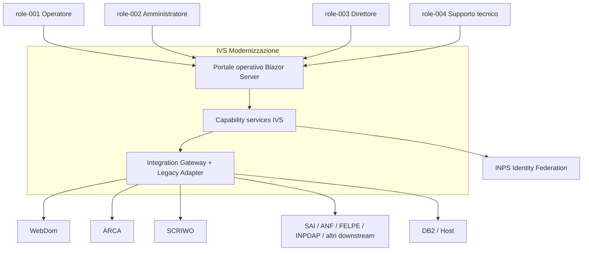
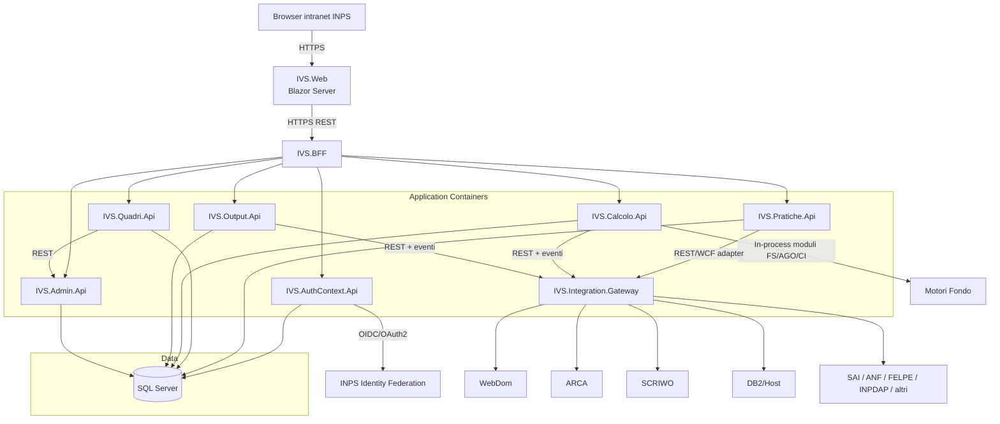
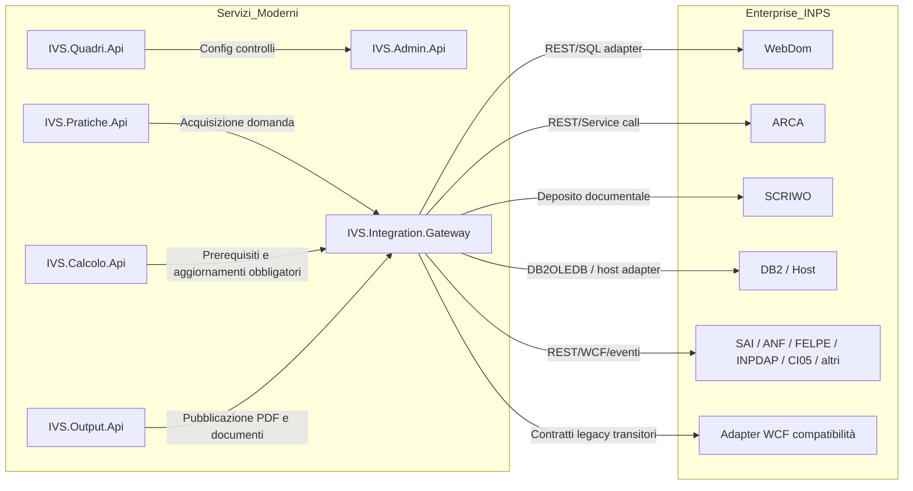

# architecture_design

## architecture_summary

| attributo | valore |
|---|---|
| primary_style | Service-Based Architecture con Strangler Fig Migration Pattern |
| architecture_quanta | 4 |
| total_services | 10 |
| total_adrs | 7 |
| tech_stack_specs_used | .NET 8 LTS, Blazor Server, ASP.NET Core REST API, SQL Server, EF Core 8, INPS Identity Federation |
| communication_pattern | Ibrido (REST sincrono + eventi asincroni per il post-calcolo) |
| data_strategy | SQL Server condiviso in transizione con evoluzione verso ownership dati per bounded context |

## architecture_characteristics

| Caratteristica | Score (1-3) | Evidenza dagli artefatti |
|---|---|---|
| Scalabilità | 3 | BR-005 e NFR-023 richiedono scalabilità orizzontale dei nuovi moduli REST, superando l’attuale stato server-side. |
| Fault Tolerance | 3 | BR-001, NFR-006 e NFR-009 impongono continuità operativa e degrado controllato rispetto a più sistemi enterprise. |
| Testabilità | 3 | BR-003 e NFR-021 richiedono copertura automatizzata dei flussi critici prima della dismissione legacy. |
| Modularity | 3 | BR-002 e FR-025 spingono la decomposizione del God Contract PN812 in capability API esplicite e versionate. |
| Evolvability | 3 | BR-003, NFR-025 e il vincolo Strangler Fig del PRD favoriscono evoluzione incrementale per capability. |
| Performance | 2 | NFR-001..NFR-005 definiscono tempi di risposta stringenti ma non tali da imporre microservizi spinti o HPC. |
| Deployability | 2 | NFR-022 e PRD §4.3 richiedono ambienti separati, promozione automatizzata e compatibilità IIS/Kestrel. |
| Simplicity | 1 | Il dominio pensionistico e le integrazioni enterprise rendono la semplicità desiderabile ma non prioritaria. |
| Elasticity | 2 | NFR-024 richiede supporto ad almeno 200 utenti concorrenti con scaling controllato dei moduli moderni. |
| Cost | 2 | Lo scenario incrementale per capability limita il rischio economico, ma il costo non prevale su continuità e compliance. |

## style_fitness_evaluation

| Stile | Scalabilità | Fault Tolerance | Testabilità | Modularità | Evolvabilità | Semplicità | Fit Totale |
|---|---|---|---|---|---|---|---|
| Service-Based | ★★★ | ★★ | ★★★ | ★★★ | ★★★ | ★★ | 16/18 |
| Layered Monolith | ★ | ★ | ★★ | ★ | ★ | ★★★ | 9/18 |
| Microservices | ★★★ | ★★★ | ★★★ | ★★★ | ★★★ | ★ | 16/18 |
| Modulare Monolith | ★★ | ★ | ★★ | ★★ | ★★ | ★★★ | 12/18 |

## architecture_decision_records

### ADR-001: Stile Architetturale Primario

**Status:** Proposed
**Date:** 2026-06-24

**Context:**
Il legacy IVS_DNA è descritto come “monolite distribuito per domini di fondo” con PN812 come orchestratore centrale e punto di accoppiamento maggiore. BR-001, BR-002, BR-003 e FR-025 richiedono continuità operativa, riduzione del debito tecnico e compatibilità contrattuale durante una migrazione incrementale. Il PRD (§4.2) prescrive inoltre Strangler Fig obbligatorio e backward compatibility transitoria.

**Decision:**
Adottare una Service-Based Architecture orientata a capability, con decomposizione progressiva del perimetro PN812 in servizi applicativi coesi e frontiera di migrazione Strangler Fig per capability. La scelta conserva una granularità controllata, sufficiente a separare autenticazione, pratiche, quadri, calcolo, output e amministrazione senza introdurre overhead organizzativo pari a una strategia microservices pura.

**Alternatives Considered:**

| Alternative | Pros | Cons | Fitness Score |
|---|---|---|---|
| Service-Based con Strangler Fig | Bilancia modularità, continuità e governance; riduce il rischio di replatforming big-bang; allinea la decomposizione ai bounded context identificati | Richiede ancora coordinamento su database condiviso e integrazioni esterne | 9/10 |
| Layered Monolith modernizzato | Più semplice da avviare; minor numero di deployment unit | Non riduce abbastanza il coupling attuale; perpetua colli di bottiglia simili a PN812 | 5/10 |
| Microservices completi | Massima indipendenza deploy e scalabilità fine-grained | Overhead operativo elevato per dominio e infrastruttura INPS; rischio eccessivo nella transizione | 8/10 |

**Consequences:**
- Positivo: le capability possono essere rilasciate una alla volta mantenendo attivi i moduli legacy non ancora strangolati.
- Negativo: nella prima fase persistono alcune dipendenze condivise su SQL Server e sul gateway di integrazione.
- Rischi: deriva della granularità dei servizi e proliferazione di contratti se non governati con standard API e ownership chiara.

**References:**
- 00_prd.md §4.2 e §4.4
- docs/06_software_architecture.md (PN812 orchestratore centrale, SPOF logico)
- ctx-001, ctx-002, comp-004, comp-005, comp-006, comp-012, dep-021
### ADR-002: Pattern di Comunicazione

**Status:** Proposed
**Date:** 2026-06-24

**Context:**
I processi proc-004 e proc-005 sono interattivi e soggetti a NFR-002 e NFR-003, quindi richiedono risposta sincrona verso l’operatore. Il processo proc-006, invece, prevede aggiornamenti downstream e deposito documentale che possono essere tracciati separatamente. BR-007 e NFR-009 richiedono inoltre evidenza diagnostica e degrado controllato delle integrazioni.

**Decision:**
Usare un pattern ibrido: REST sincrono per i flussi utente interattivi (ricerca, quadri, verify, definitivo, consultazione output) ed eventi asincroni per le attività di post-calcolo, audit di dominio e notifiche non strettamente interattive. Questo riduce la latenza percepita sui percorsi critici e isola i ritardi delle integrazioni downstream non bloccanti.

**Alternatives Considered:**

| Alternative | Pros | Cons | Fitness Score |
|---|---|---|---|
| Ibrido REST + eventi | Ottimo fit con processi utente sincroni e post-calcolo differibile; favorisce resilienza e tracing | Richiede governance doppia di API ed eventi | 9/10 |
| Solo REST sincrono | Più semplice da capire e testare inizialmente | Amplifica tempi di attesa e fan-out durante il post-calcolo | 6/10 |
| Event-driven end-to-end | Disaccoppia fortemente e scala bene | Complica verify/definitivo interattivi e auditing immediato richiesto dagli operatori | 7/10 |

**Consequences:**
- Positivo: i tempi di risposta dei flussi interattivi restano prevedibili e misurabili.
- Negativo: è necessario introdurre semantica chiara sugli eventi di post-calcolo e gestione delle retry.
- Rischi: duplicazione di logica tra esiti sincroni e asincroni se non viene definito un modello unico di correlation-id.

**References:**
- NFR-002, NFR-003, NFR-009
- proc-004, proc-005, proc-006
- dep-013, dep-014, dep-018
### ADR-003: Strategia Database

**Status:** Proposed
**Date:** 2026-06-24

**Context:**
Il PRD (§4.5) impone SQL Server come persistenza principale e pone fuori scope la migrazione verso altro RDBMS. docs/08_data.md evidenzia una separazione logica già presente per fondo e capability, ma non un vero database-per-service. Le dipendenze dep-019 e risk-001 mostrano il rischio di forte coupling sullo schema condiviso.

**Decision:**
Adottare una strategia ibrida: SQL Server condiviso nella fase iniziale di migrazione, con ownership logica per bounded context e percorso evolutivo verso schemi o database dedicati per dominio quando una capability raggiunge autonomia sufficiente. Entity Framework Core 8 governa l’accesso ai dati moderni, mentre stored procedure critiche possono restare incapsulate dove necessario.

**Alternatives Considered:**

| Alternative | Pros | Cons | Fitness Score |
|---|---|---|---|
| Ibrida shared-to-bounded | Compatibile con i vincoli attuali e progressivamente evolutiva | Richiede disciplina forte di ownership e anti-corruption layer interni | 9/10 |
| Database condiviso permanente | Riduce sforzo iniziale e semplifica reporting legacy | Mantiene coupling strutturale e rallenta autonomia di release dei servizi | 6/10 |
| Database-per-service immediato | Massima autonomia dei servizi | Rischio elevato su continuità, migrazione dati e impatti su contratti legacy | 5/10 |

**Consequences:**
- Positivo: si allinea ai vincoli di progetto senza bloccare l’evoluzione futura.
- Negativo: durante la transizione persistono aree di schema condiviso e necessità di coordinamento tra team.
- Rischi: regressioni dovute a regole di business ancora in stored procedure legacy o dati condivisi non ancora isolati.

**References:**
- 00_prd.md §4.1 e §4.5
- docs/08_data.md (ownership logica e rischi sullo schema)
- ent-001, ent-012, ent-023, dep-019, risk-001
### ADR-004: Pattern di Integrazione

**Status:** Proposed
**Date:** 2026-06-24

**Context:**
FR-023, FR-024 e FR-025 impongono la conservazione delle integrazioni con WebDom, ARCA, DB2/Host, SCRIWO e degli adapter di compatibilità legacy. L’architettura legacy mostra un pattern point-to-point via WCF SOAP e accessi eterogenei (docs/06_software_architecture.md). Il nuovo perimetro deve evitare che ogni capability replichi la complessità di protocolli e contratti esterni.

**Decision:**
Introdurre una combinazione di API Gateway/BFF verso il frontend e Integration Gateway verso sistemi enterprise e consumer legacy. Il Gateway di integrazione ospita adapter REST/WCF/DB2, traduce contratti, gestisce policy di resilienza e permette di mantenere WCF solo come strato transitorio di compatibilità.

**Alternatives Considered:**

| Alternative | Pros | Cons | Fitness Score |
|---|---|---|---|
| API Gateway + Integration Gateway | Isola complessità, centralizza policy di compatibilità e riduce duplicazioni | Richiede governo attento per evitare che il gateway diventi un nuovo monolite | 9/10 |
| Integrazioni point-to-point per servizio | Semplice per singola capability | Replica codice di integrazione e amplifica l’accoppiamento con i sistemi enterprise | 4/10 |
| Solo backbone eventi | Ottimo disaccoppiamento per alcuni flussi | Insufficiente per sistemi legacy sincroni, DB2 e contratti WCF da preservare | 6/10 |

**Consequences:**
- Positivo: i servizi di dominio restano focalizzati sul business, mentre i protocolli legacy sono confinati.
- Negativo: il gateway richiede forte osservabilità e capacità di scaling dedicate.
- Rischi: se il gateway cresce senza limiti può replicare il ruolo accentratore di PN812.

**References:**
- FR-023, FR-024, FR-025
- docs/06_software_architecture.md §5
- comp-002, comp-012, dep-008, dep-013, dep-014
### ADR-005: Architettura Frontend

**Status:** Proposed
**Date:** 2026-06-24

**Context:**
Il PRD (§4.1) ammette Blazor Server, Blazor WebAssembly o React. NFR-018 richiede che un operatore esperto completi il ciclo principale senza training aggiuntivo, mentre NFR-004 impone caricamento rapido delle schermate. Il dominio è fortemente form-based, con molte maschere di inserimento e feedback guidato da semafori.

**Decision:**
Adottare Blazor Server come tecnologia primaria per il frontend operativo, con composizione tramite BFF e componenti UI coerenti con il dominio pensionistico. La scelta privilegia produttività .NET end-to-end, facilità di integrazione con il modello applicativo e riduzione del cambio di contesto tecnologico nel team di modernizzazione.

**Alternatives Considered:**

| Alternative | Pros | Cons | Fitness Score |
|---|---|---|---|
| Blazor Server | Massimizza riuso competenze .NET, accelera delivery di form complesse e mantiene UX coerente | Richiede attenzione allo stato di connessione e al dimensionamento delle sessioni interattive | 9/10 |
| React SPA | Grande flessibilità frontend e ricco ecosistema | Aumenta la frammentazione tecnologica e il costo di onboarding nel contesto attuale | 7/10 |
| Blazor WebAssembly | Allinea il linguaggio lato client ma con esecuzione client-side | Più delicato per payload iniziale, integrazione intranet e gestione di capability sensibili | 6/10 |

**Consequences:**
- Positivo: riduce il time-to-market dei flussi operativi più ricchi di maschere e validazioni.
- Negativo: il team deve governare con cura la scalabilità dei circuiti interattivi Blazor Server.
- Rischi: se si sposta troppa logica lato UI si reintroduce coupling simile al frontend legacy; il BFF resta quindi obbligatorio.

**References:**
- 00_prd.md §4.1
- NFR-004, NFR-018
- comp-001, comp-002, proc-003, proc-004
### ADR-006: Strategia Autenticazione e Autorizzazione

**Status:** Proposed
**Date:** 2026-06-24

**Context:**
FR-001..FR-004 e NFR-010..NFR-015 richiedono identità federata INPS, autorizzazioni granulari per ruolo e sede, timeout di sessione e audit degli accessi negati. Il PRD (§4.6) vieta credenziali in chiaro e richiede secret vault. L’architettura target deve quindi distinguere tra autenticazione utente, autorizzazione applicativa e gestione dei segreti tecnici.

**Decision:**
Usare INPS Identity Federation come sorgente di autenticazione, propagare claims di ruolo e sede verso i servizi, e implementare RBAC applicativo con controllo di contesto nel Servizio Autenticazione e Contesto. I segreti applicativi non utente (connection string, certificati, credenziali tecniche) sono custoditi in vault istituzionale, mentre audit e timeout di sessione sono enforceati centralmente.

**Alternatives Considered:**

| Alternative | Pros | Cons | Fitness Score |
|---|---|---|---|
| INPS Federation + RBAC + Vault | Allineato ai vincoli di sicurezza e alla governance INPS | Richiede integrazione accurata delle claims con i servizi di dominio | 10/10 |
| Autenticazione legacy proprietaria | Impatto minimo iniziale sul codice storico | Non conforme ai vincoli di sicurezza e non sostenibile nel target .NET 8 | 2/10 |
| JWT custom indipendente dal sistema INPS | Flessibile per architetture moderne | Duplica responsabilità identitaria già risolte da INPS e aumenta rischio compliance | 5/10 |

**Consequences:**
- Positivo: sicurezza, audit e autorizzazioni diventano coerenti su tutte le capability modernizzate.
- Negativo: i servizi devono essere progettati per leggere claims e contesto in modo uniforme, pena comportamenti divergenti.
- Rischi: mappature incomplete ruolo-sede o secret management incompleto possono bloccare il rollout in produzione.

**References:**
- 00_prd.md §4.6
- FR-001, FR-002, FR-003, FR-004
- comp-003, ent-009, ent-025, dep-002, dep-022
### ADR-007: Osservabilità e Resilienza

**Status:** Proposed
**Date:** 2026-06-24

**Context:**
BR-007 e NFR-019 richiedono log strutturati, correlation-id e dashboard su latenza, error rate e throughput. NFR-009 e i rischi risk-002/risk-003 impongono degradazione controllata quando i sistemi enterprise non sono disponibili. La soluzione deve inoltre mantenere audit operativo distinguendo eventi di business da telemetria tecnica.

**Decision:**
Adottare structured logging, metriche e tracing distribuito come baseline osservabile, combinati con circuit breaker, retry idempotenti e timeout espliciti sulle integrazioni esterne. L’audit di business resta separato dai log tecnici ma correlato tramite transactionId e correlation-id univoci. Serilog, OpenTelemetry/Prometheus e Polly rappresentano la baseline tecnica coerente con .NET 8.

**Alternatives Considered:**

| Alternative | Pros | Cons | Fitness Score |
|---|---|---|---|
| Structured logging + metrics + circuit breaker | Supporta diagnosi rapida, governance SRE e fault containment | Introduce disciplina architetturale e costo iniziale di setup | 9/10 |
| Logging minimo applicativo | Costo iniziale basso | Non soddisfa BR-007 né diagnosi su integrazioni multiple | 3/10 |
| APM tecnico senza audit di dominio | Buona visibilità tecnica | Non copre accountability e tracciatura delle azioni sensibili di processo | 6/10 |

**Consequences:**
- Positivo: i fault esterni diventano misurabili e gestibili senza perdere la visibilità del processo pensionistico.
- Negativo: serve una tassonomia comune di eventi, metriche e correlation-id per tutti i servizi.
- Rischi: se osservabilità e audit non sono progettati insieme, si avranno silos informativi e tempi di diagnosi ancora lunghi.

**References:**
- BR-007, NFR-009, NFR-019
- dep-013, dep-014, risk-002, risk-003
- comp-006, comp-010, comp-012, ent-025

## c4_context_diagram

## c4_container_diagram

## component_service_mapping

| component_id | component_name | service_name | deployment_unit | communication |
|---|---|---|---|---|
| comp-001 | Frontend Operativo Blazor Server | IVS.Web | Container Web / IIS o Kestrel | HTTPS |
| comp-002 | API Gateway / BFF | IVS.BFF | Container Edge | HTTPS REST |
| comp-003 | Servizio Autenticazione e Contesto | IVS.AuthContext.Api | Container API | REST |
| comp-004 | Servizio Ricerca Pratiche | IVS.Pratiche.Api | Container API | REST |
| comp-005 | Servizio Quadri Applicativi | IVS.Quadri.Api | Container API | REST |
| comp-006 | Servizio Calcolo | IVS.Calcolo.Api | Container API | REST + eventi interni |
| comp-007 | Motore Calcolo FS | IVS.Calcolo.Api | Modulo interno al container Calcolo | In-process |
| comp-008 | Motore Calcolo AGO | IVS.Calcolo.Api | Modulo interno al container Calcolo | In-process |
| comp-009 | Motore Calcolo CI | IVS.Calcolo.Api | Modulo interno al container Calcolo | In-process |
| comp-010 | Servizio Post-Calcolo e Stampa | IVS.Output.Api | Container API | REST + eventi |
| comp-011 | Servizio Amministrazione | IVS.Admin.Api | Container API | REST |
| comp-012 | Integration Gateway | IVS.Integration.Gateway / IVS.Legacy.Adapter | Container Gateway + Adapter compatibilità | REST + WCF adapter + DB2OLEDB |

## integration_architecture

## cross_cutting_concerns

| Concern | Pattern | Tecnologia | Riferimento ADR |
|---|---|---|---|
| Autenticazione | INPS Federation OIDC/OAuth2 + claims ruolo-sede | Identity Provider federato INPS | ADR-006 |
| Osservabilità | Structured Logging + Metrics + Tracing | Serilog + OpenTelemetry/Prometheus | ADR-007 |
| Resilienza | Circuit Breaker + Retry + Timeout | Polly | ADR-007 |
| Configurazione | Configuration by environment + secret vault | .NET IConfiguration + Azure Key Vault o equivalente INPS | ADR-006 |
| Audit Trail | Audit applicativo immutabile + correlation-id | Middleware custom + SQL Server + bus eventi di dominio | ADR-006 |

## architecture_quantum_analysis

| quantum_id | quantum_name | services | coupling_point | characteristics |
|---|---|---|---|---|
| q-001 | Frontend + BFF quantum | IVS.Web; IVS.BFF | Contratti UI/BFF, sessione utente e policy edge | Ottimizzato per UX operativa, latenza bassa e scalabilità orizzontale stateless sul BFF. |
| q-002 | Gestione Pratiche + Quadri quantum | IVS.AuthContext.Api; IVS.Pratiche.Api; IVS.Quadri.Api; IVS.Admin.Api | Stato pratica, contesto ruolo-sede, configurazioni di controllo e persistenza transazionale | Boundary più critico e stateful del sistema; richiede coerenza, audit e forte governance del dato. |
| q-003 | Calcolo Pensione quantum | IVS.Calcolo.Api; Motore FS; Motore AGO; Motore CI | Aggregate di calcolo, routing di fondo, transactionId e chiave pensione | Ottimizzato per correttezza funzionale, resilienza verso dipendenze esterne e parallel run rispetto al legacy. |
| q-004 | Integrazione Enterprise quantum | IVS.Output.Api; IVS.Integration.Gateway; IVS.Legacy.Adapter | Contratti enterprise, adapter WCF/DB2, eventi post-calcolo e documenti di pratica | Boundary anti-corruption che isola protocolli eterogenei e protegge il core modernizzato dal coupling legacy. |

ARCHITECTURE_DESIGN_COMPLETED: 7 ADRs produced, 4 quanta identified, primary style: Service-Based Architecture con Strangler Fig
