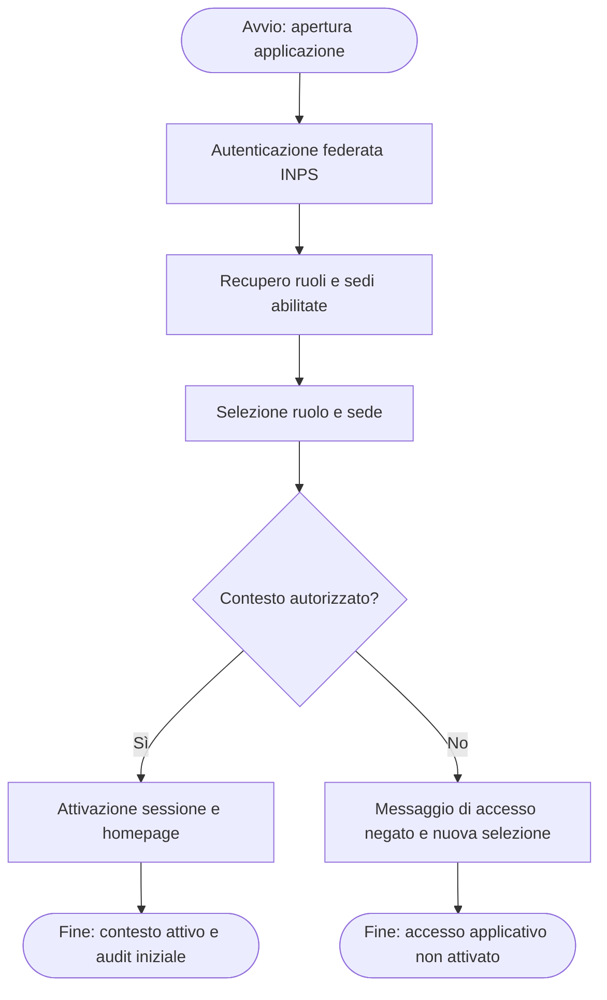
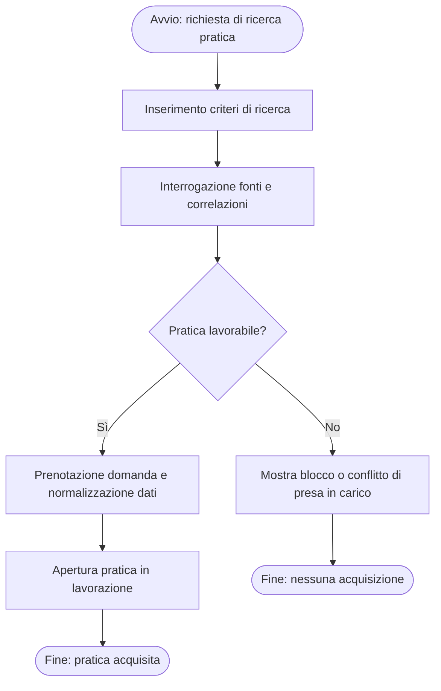
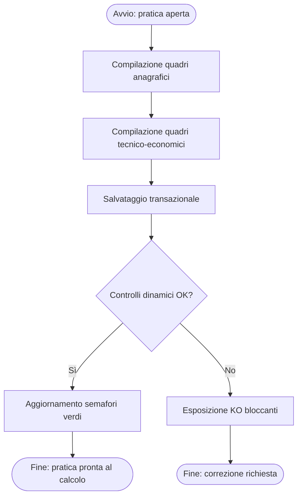
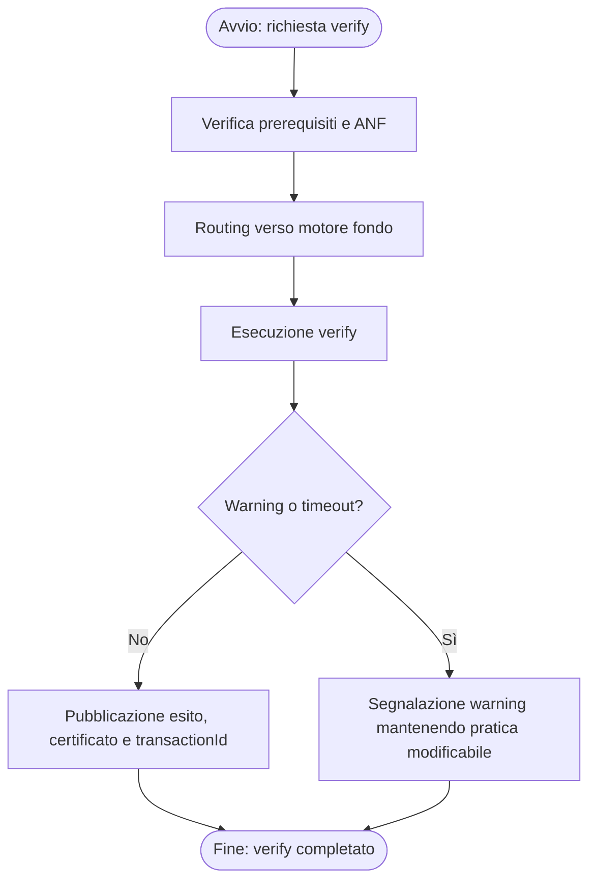
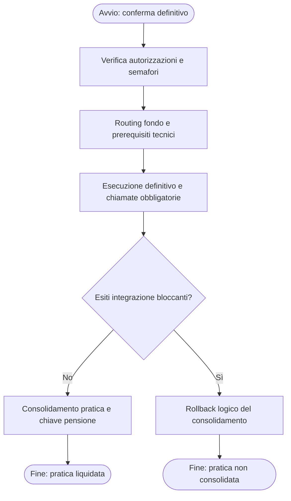
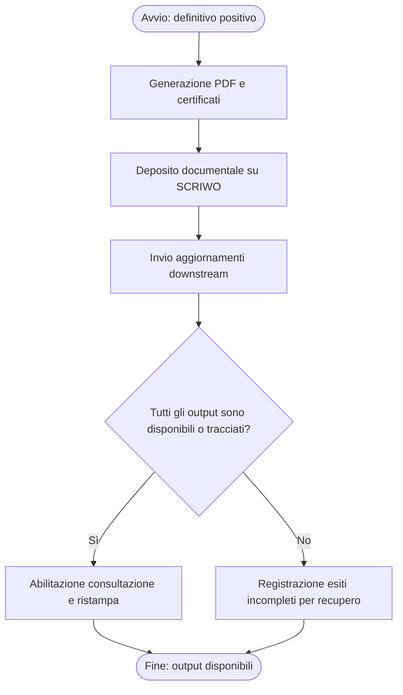
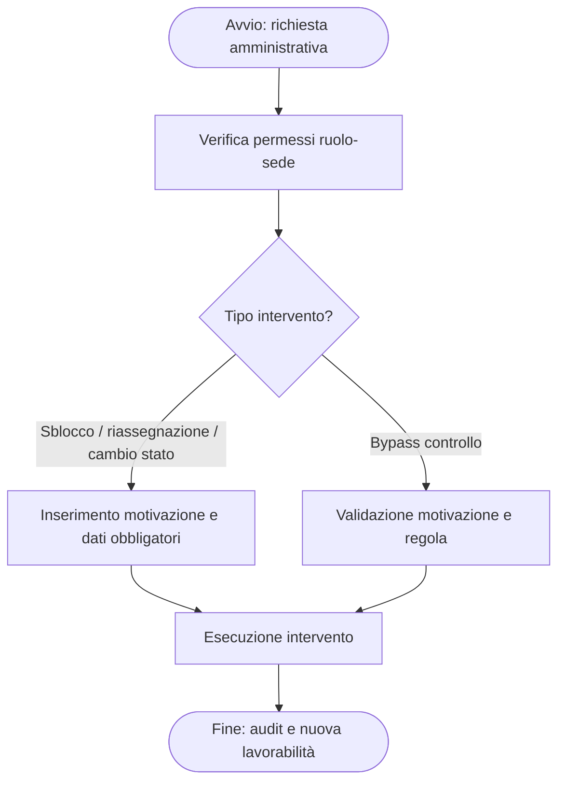
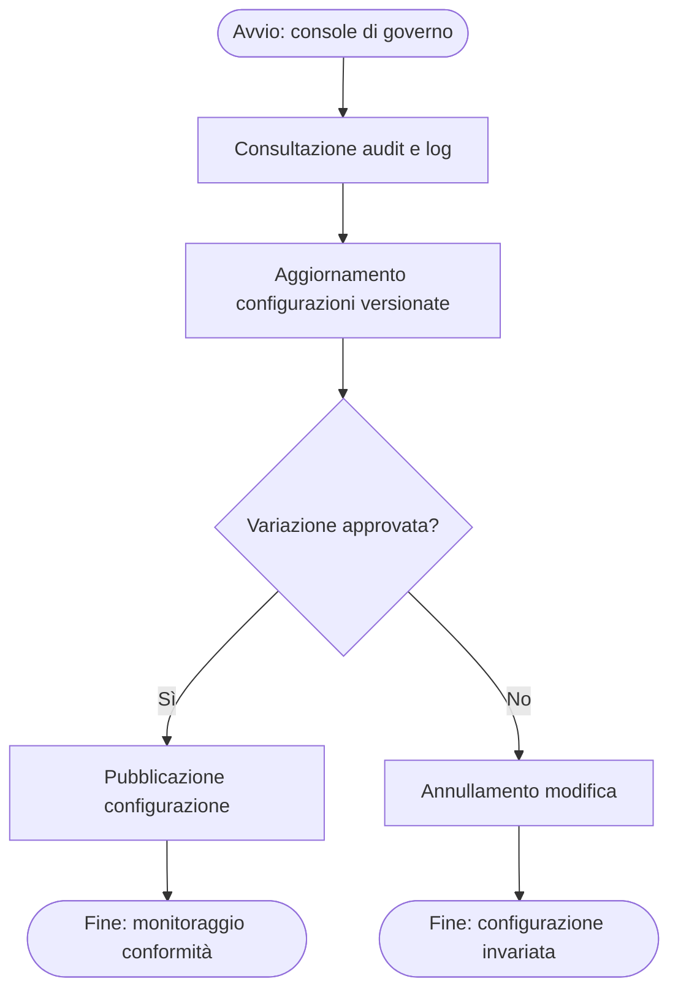

# business_processes

## process_catalog

| process_id | process_name | process_type | process_description | trigger | actors | input_entities | output_entities | related_requirement_ids |
|---|---|---|---|---|---|---|---|---|
| proc-001 | Autenticazione e Selezione Contesto | Core | Gestisce accesso federato, selezione ruolo-sede, attivazione sessione e audit iniziale per tutti i profili applicativi. | Apertura dell’applicazione IVS modernizzata dalla intranet INPS. | role-001; role-002; role-003; role-004 | ent-009 | ent-009; ent-025 | FR-001; FR-002; FR-003; FR-004; UC-001 |
| proc-002 | Ricerca e Acquisizione Pratica | Core | Permette di cercare domande, disambiguare i risultati, verificare i vincoli di presa in carico e prenotare la pratica. | Richiesta operatore di individuare una domanda da lavorare. | role-001 | ent-009; ent-002; ent-005 | ent-001; ent-010; ent-020 | FR-005; FR-006; FR-007; FR-008; UC-002; UC-003 |
| proc-003 | Compilazione Quadri Applicativi | Core | Supporta compilazione, salvataggio transazionale, controlli dinamici e gestione dei semafori sui quadri della pratica. | Apertura di una pratica acquisita in lavorazione. | role-001 | ent-001; ent-003; ent-005; ent-006; ent-007; ent-008 | ent-003; ent-024; ent-025 | FR-009; FR-010; FR-011; FR-012; UC-004; UC-005; UC-006; UC-007 |
| proc-004 | Calcolo Verify | Core | Esegue il verify non definitivo, applica prerequisiti di fondo e restituisce esito, certificato e riferimenti tecnici senza consolidare la pratica. | Richiesta dell’operatore di simulare il calcolo prima del definitivo. | role-001 | ent-001; ent-012; ent-013; ent-023 | ent-015; ent-016; ent-018 | FR-013; FR-015; FR-016; UC-008 |
| proc-005 | Calcolo Definitivo | Core | Consolida la pratica, instrada il motore corretto e coordina gli aggiornamenti obbligatori verso i sistemi downstream. | Conferma esplicita dell’operatore di eseguire la liquidazione definitiva. | role-001 | ent-001; ent-012; ent-013; ent-015; ent-020 | ent-014; ent-019; ent-021; ent-025 | FR-014; FR-015; FR-016; FR-024; UC-009 |
| proc-006 | Post-Calcolo e Stampa | Core | Genera PDF, pubblica documenti, registra gli esiti di aggiornamento e abilita consultazione o ristampa degli output finali. | Presenza di un definitivo consolidato con esito positivo. | role-001; role-002 | ent-001; ent-019; ent-022 | ent-022; ent-021; ent-025 | FR-017; FR-018; FR-019; UC-010; UC-011 |
| proc-007 | Gestione Amministrativa Pratica | Supporting | Consente sblocco, riassegnazione, cambio stato e bypass controlli con motivazione e audit per ruoli autorizzati. | Anomalia operativa o richiesta di intervento amministrativo su una pratica. | role-002; role-003 | ent-001; ent-023; ent-026 | ent-011; ent-027; ent-025 | FR-020; FR-021; FR-022; UC-012; UC-013 |
| proc-008 | Configurazione e Audit | Management | Gestisce configurazioni di controllo, consultazione audit e monitoraggio di conformità delle capability modernizzate. | Richiesta di governo tecnico o amministrativo del sistema. | role-002; role-004 | ent-023; ent-025; ent-026 | ent-023; ent-024; ent-025 | FR-004; FR-012; FR-022; FR-025; UC-014; UC-015 |

## process_steps

| process_id | step_id | step_order | step_name | step_description | step_type | actor | decision_condition |
|---|---|---|---|---|---|---|---|
| proc-001 | step-001 | 1 | Avvio accesso | L’utente apre l’applicazione dalla intranet INPS. | Start | role-001 |  |
| proc-001 | step-002 | 2 | Autenticazione federata | Il sistema reindirizza al provider di identità e valida l’identità utente. | Action | role-001 |  |
| proc-001 | step-003 | 3 | Recupero profilo | Vengono recuperati ruoli, sedi e attributi utili al contesto operativo. | Action | role-001 |  |
| proc-001 | step-004 | 4 | Selezione ruolo e sede | L’utente seleziona il contesto di lavoro desiderato. | Action | role-001 |  |
| proc-001 | step-005 | 5 | Verifica autorizzazione contesto | Il sistema verifica coerenza fra ruolo, sede e profilo federato. | Decision | role-001 | Se il ruolo-sede selezionato è abilitato il contesto viene attivato, altrimenti l’accesso viene negato. |
| proc-001 | step-006 | 6 | Attivazione sessione e audit | Il contesto viene attivato e il primo evento di audit viene persistito. | End | role-001 |  |
| proc-002 | step-007 | 1 | Apertura ricerca | L’operatore entra nella funzione di ricerca pratica. | Start | role-001 |  |
| proc-002 | step-008 | 2 | Inserimento criteri | L’operatore inserisce NDomus, codice fiscale o dati anagrafici. | Action | role-001 |  |
| proc-002 | step-009 | 3 | Ricerca e correlazione | Il sistema interroga le fonti disponibili e prepara la lista con eventuali correlazioni. | Action | role-001 |  |
| proc-002 | step-010 | 4 | Decisione di lavorabilità | Il sistema verifica se esiste una domanda lavorabile e non già detenuta. | Decision | role-001 | Se la pratica è già in lavorazione o non coerente con sede/ruolo viene emesso un blocco. |
| proc-002 | step-011 | 5 | Prenotazione e normalizzazione | La domanda viene prenotata e arricchita con dati WebDom e ARCA. | Action | role-001 |  |
| proc-002 | step-012 | 6 | Apertura pratica | La pratica viene aperta con ownership esplicita e dataset normalizzato. | End | role-001 |  |
| proc-003 | step-013 | 1 | Apertura pratica acquisita | L’operatore apre la pratica e i quadri disponibili per il fondo. | Start | role-001 |  |
| proc-003 | step-014 | 2 | Compilazione quadri anagrafici | Vengono gestiti titolare, familiari e soggetti collegati. | Action | role-001 |  |
| proc-003 | step-015 | 3 | Compilazione quadri tecnico-economici | L’operatore completa liquidazione, contributi, redditi, pagamenti e oneri. | Action | role-001 |  |
| proc-003 | step-016 | 4 | Salvataggio transazionale | Il sistema salva i dati garantendo coerenza tra quadri correlati. | Action | role-001 |  |
| proc-003 | step-017 | 5 | Esecuzione controlli e semafori | I controlli dinamici vengono eseguiti e i semafori aggiornati. | Decision | role-001 | Se esistono KO bloccanti l’avanzamento si ferma, altrimenti la pratica resta pronta al passo successivo. |
| proc-003 | step-018 | 6 | Persistenza contesto di lavoro | La pratica resta riprendibile con stato e posizione di lavoro coerenti. | End | role-001 |  |
| proc-004 | step-019 | 1 | Richiesta verify | L’operatore avvia il calcolo verify dalla pratica compilata. | Start | role-001 |  |
| proc-004 | step-020 | 2 | Verifica prerequisiti | Il sistema controlla semafori, fondo e prerequisiti ANF. | Action | role-001 |  |
| proc-004 | step-021 | 3 | Routing motore fondo | La richiesta viene instradata verso il motore FS, AGO o CI appropriato. | Action | role-001 |  |
| proc-004 | step-022 | 4 | Esecuzione verify | Il motore produce stato pensione, certificato ed esiti tecnici. | Action | role-001 |  |
| proc-004 | step-023 | 5 | Valutazione warning | Il sistema distingue warning non bloccanti da anomalie da mostrare all’operatore. | Decision | role-001 | Se la dipendenza esterna è temporaneamente degradata l’esito resta non consolidato ma tracciato. |
| proc-004 | step-024 | 6 | Pubblicazione esito verify | L’operatore riceve esito, transactionId e pratica ancora modificabile. | End | role-001 |  |
| proc-005 | step-025 | 1 | Conferma definitivo | L’operatore conferma l’operazione sensibile di liquidazione definitiva. | Start | role-001 |  |
| proc-005 | step-026 | 2 | Verifica autorizzazioni e stato | Il sistema verifica ruolo, semafori e prerequisiti di consolidamento. | Action | role-001 |  |
| proc-005 | step-027 | 3 | Routing e prerequisiti tecnici | Vengono eseguiti routing fondo, ANF e aggiornamenti preliminari necessari. | Action | role-001 |  |
| proc-005 | step-028 | 4 | Esecuzione definitivo | Il motore produce il risultato definitivo e le richieste verso i downstream obbligatori. | Action | role-001 |  |
| proc-005 | step-029 | 5 | Verifica esiti di integrazione | Il sistema decide se consolidare in base agli esiti bloccanti delle integrazioni obbligatorie. | Decision | role-001 | Se un sistema obbligatorio fallisce il consolidamento viene annullato e la pratica resta correggibile. |
| proc-005 | step-030 | 6 | Consolidamento e audit | Chiave pensione, stato finale e audit vengono persistiti con esito tracciato. | End | role-001 |  |
| proc-006 | step-031 | 1 | Avvio post-calcolo | La pratica definitiva positiva abilita la fase di produzione output. | Start | role-001 |  |
| proc-006 | step-032 | 2 | Generazione PDF | Il sistema produce la stampa finale e gli eventuali certificati allegati. | Action | role-001 |  |
| proc-006 | step-033 | 3 | Deposito documentale | I documenti vengono pubblicati verso SCRIWO o servizio equivalente. | Action | role-001 |  |
| proc-006 | step-034 | 4 | Aggiornamenti downstream | Vengono inviate notifiche e aggiornamenti ai sistemi enterprise previsti. | Action | role-001 |  |
| proc-006 | step-035 | 5 | Verifica completezza output | Il sistema valuta se tutti gli output richiesti sono disponibili o almeno tracciati. | Decision | role-001 | Se un aggiornamento non bloccante fallisce viene registrato e reso visibile per recupero operativo. |
| proc-006 | step-036 | 6 | Consultazione e ristampa | Gli output restano consultabili o ristampabili per operatori autorizzati. | End | role-002 |  |
| proc-007 | step-037 | 1 | Apertura intervento amministrativo | L’amministratore o il direttore identifica la pratica da correggere. | Start | role-002 |  |
| proc-007 | step-038 | 2 | Verifica autorizzazione amministrativa | Il sistema controlla ruolo, sede e permessi per l’operazione richiesta. | Action | role-002 |  |
| proc-007 | step-039 | 3 | Selezione azione correttiva | Viene scelta l’azione di sblocco, riassegnazione, cambio stato o bypass. | Decision | role-002 | La scelta determina i dati obbligatori e la tracciatura da applicare. |
| proc-007 | step-040 | 4 | Inserimento motivazione | L’utente inserisce motivazione, destinatario o nuovo stato dove richiesto. | Action | role-002 |  |
| proc-007 | step-041 | 5 | Esecuzione intervento | Il sistema applica l’intervento amministrativo e aggiorna la pratica. | Action | role-002 |  |
| proc-007 | step-042 | 6 | Audit e ripristino lavorabilità | L’esito viene registrato e la pratica torna lavorabile nel contesto corretto. | End | role-003 |  |
| proc-008 | step-043 | 1 | Apertura console di governo | Supporto tecnico o amministrazione apre console audit/configurazione. | Start | role-004 |  |
| proc-008 | step-044 | 2 | Consultazione audit e log | Vengono raccolte evidenze operative e tecniche sui flussi in corso o conclusi. | Action | role-004 |  |
| proc-008 | step-045 | 3 | Aggiornamento regole e abilitazioni | Le configurazioni dei controlli dinamici vengono modificate in modo versionato. | Action | role-002 |  |
| proc-008 | step-046 | 4 | Valutazione impatto | Si verifica che la modifica sia coerente con fondo, capability e finestra operativa. | Decision | role-002 | Se la variazione non è approvata o non è completa deve essere annullata. |
| proc-008 | step-047 | 5 | Pubblicazione configurazione | La nuova configurazione viene resa attiva e propagata ai servizi interessati. | Action | role-002 |  |
| proc-008 | step-048 | 6 | Monitoraggio conformità | Il servizio di audit verifica effetti, accessi e compatibilità della capability rilasciata. | End | role-004 |  |

## process_flow_diagrams

### proc-001: Autenticazione e Selezione Contesto

### proc-002: Ricerca e Acquisizione Pratica

### proc-003: Compilazione Quadri Applicativi

### proc-004: Calcolo Verify

### proc-005: Calcolo Definitivo

### proc-006: Post-Calcolo e Stampa

### proc-007: Gestione Amministrativa Pratica

### proc-008: Configurazione e Audit

PROCESSES_COMPLETED
