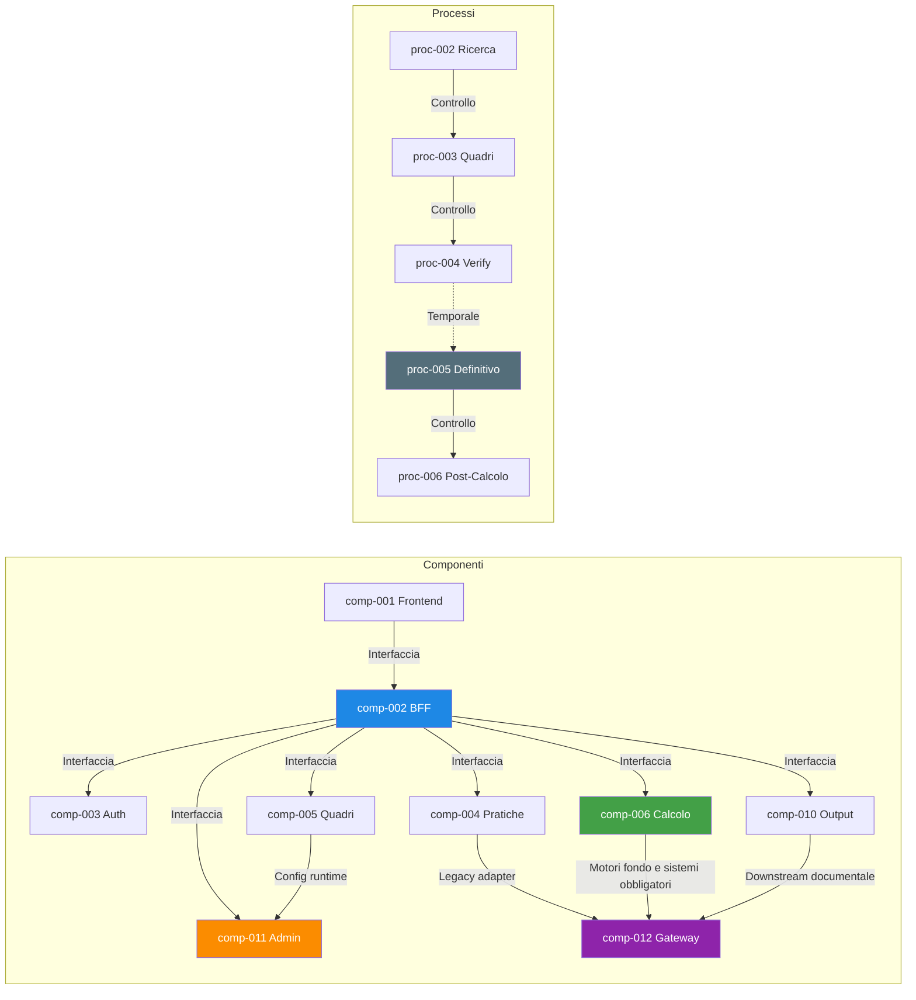

# dependency_map

## dependency_catalog

| dependency_id | source_id | source_type | target_id | target_type | dependency_type | dependency_description | coupling_level | risk_flag |
|---|---|---|---|---|---|---|---|---|
| dep-001 | comp-001 | Component | comp-002 | Component | Interface Dependency | Il frontend usa il BFF come unico punto di accesso per evitare orchestrazione client-side frammentata. | Loose | Nessuno |
| dep-002 | comp-002 | Component | comp-003 | Component | Interface Dependency | Il BFF richiede le API di autenticazione e contesto per attivare la sessione operativa. | Medium | Collo di bottiglia |
| dep-003 | comp-002 | Component | comp-004 | Component | Interface Dependency | Il BFF invoca il servizio di ricerca pratica per lista risultati, disambiguazione e acquisizione. | Medium | Nessuno |
| dep-004 | comp-002 | Component | comp-005 | Component | Interface Dependency | Il BFF compone le schermate quadri leggendo e salvando dati tramite il servizio dedicato. | Medium | Nessuno |
| dep-005 | comp-002 | Component | comp-006 | Component | Interface Dependency | Il BFF invoca il servizio di calcolo per verify, definitivo e lettura esiti. | Medium | Nessuno |
| dep-006 | comp-002 | Component | comp-010 | Component | Interface Dependency | Il BFF usa il servizio output per generazione PDF, consultazione e ristampa. | Loose | Nessuno |
| dep-007 | comp-002 | Component | comp-011 | Component | Interface Dependency | Il BFF demanda a amministrazione le operazioni eccezionali e la consultazione audit. | Loose | Nessuno |
| dep-008 | comp-004 | Component | comp-012 | Component | Interface Dependency | Ricerca e acquisizione usano il gateway di integrazione per WebDom e ARCA. | Tight | Deriva contrattuale |
| dep-009 | comp-005 | Component | comp-011 | Component | Data Dependency | I quadri leggono configurazioni di controllo, abilitazioni e bypass governati dal servizio amministrazione. | Medium | Regole condivise |
| dep-010 | comp-006 | Component | comp-007 | Component | Interface Dependency | L’orchestratore di calcolo invoca il modulo FS per formule e regole specialistiche. | Medium | Nessuno |
| dep-011 | comp-006 | Component | comp-008 | Component | Interface Dependency | L’orchestratore di calcolo invoca il modulo AGO per formule e regole specialistiche. | Medium | Nessuno |
| dep-012 | comp-006 | Component | comp-009 | Component | Interface Dependency | L’orchestratore di calcolo invoca il modulo CI per formule e regole specialistiche. | Medium | Nessuno |
| dep-013 | comp-006 | Component | comp-012 | Component | Interface Dependency | Il servizio calcolo usa il gateway per ANF, Oneri, INPDAP e altri sistemi obbligatori. | Tight | SPOF esterno |
| dep-014 | comp-010 | Component | comp-012 | Component | Interface Dependency | Il post-calcolo usa il gateway per SCRIWO, StampeWeb e altri downstream di processo. | Tight | SPOF esterno |
| dep-015 | proc-002 | Process | proc-003 | Process | Control Dependency | La pratica deve essere acquisita con successo prima dell’apertura dei quadri applicativi. | Medium | Collo di bottiglia |
| dep-016 | proc-003 | Process | proc-004 | Process | Control Dependency | La compilazione coerente dei quadri è prerequisito del calcolo verify. | Medium | Nessuno |
| dep-017 | proc-004 | Process | proc-005 | Process | Temporal Dependency | Il definitivo segue il verify oppure un esito equivalente validato di processo. | Loose | Governance |
| dep-018 | proc-005 | Process | proc-006 | Process | Control Dependency | Solo un definitivo consolidato abilita stampa, deposito documentale e output finali. | Medium | Nessuno |
| dep-019 | comp-011 | Component | ent-023 | Entity | Data Dependency | Il servizio amministrazione è il proprietario della configurazione dei controlli dinamici. | Tight | Schema condiviso |
| dep-020 | comp-006 | Component | ent-012 | Entity | Data Dependency | Il servizio calcolo governa il ciclo di vita dell’aggregate di calcolo pensione. | Tight | Nessuno |
| dep-021 | ent-001 | Entity | ent-012 | Entity | Data Dependency | Il calcolo dipende dallo stato della pratica e dal dataset compilato nei quadri. | Medium | Stato condiviso |
| dep-022 | comp-003 | Component | comp-011 | Component | Interface Dependency | Autenticazione e contesto demandano ad amministrazione audit avanzato e policy di governance. | Loose | Collo di bottiglia |

## risk_analysis

| risk_id | risk_description | involved_elements | risk_severity | mitigation_suggestion |
|---|---|---|---|---|
| risk-001 | Persistenza SQL Server condivisa fra più capability con rischio di accoppiamento sullo schema durante la transizione. | comp-004; comp-005; comp-006; comp-010; comp-011 | Alta | Introdurre ownership logica per bounded context, repository dedicati e piano graduale di separazione schema-per-dominio. |
| risk-002 | Forte dipendenza da WebDom, ARCA e host DB2 tramite gateway di integrazione, con possibilità di fault esterni bloccanti. | comp-012; dep-008; dep-013; dep-014 | Alta | Applicare circuit breaker, retry idempotenti, cache di sola lettura dove possibile e runbook operativi di degrado controllato. |
| risk-003 | API Gateway / BFF come punto di ingresso unico può diventare single point of failure logico e prestazionale. | comp-002; dep-001; dep-002; dep-003; dep-004; dep-005 | Media | Rendere il BFF stateless, scalabile orizzontalmente e limitato alla sola composizione, evitando business logic persistente. |
| risk-004 | Compatibilità contrattuale durante la transizione WCF/REST può generare deriva dei contratti e regressioni sui consumer legacy. | comp-012; dep-008; dep-013; FR-025 | Alta | Versionare esplicitamente i contratti, introdurre test di contract compatibility e mantenere adapter WCF solo fino alla dismissione controllata. |
| risk-005 | Configurazioni e bypass amministrativi centralizzati possono alterare il comportamento dei controlli in produzione se privi di governance forte. | comp-011; ent-023; ent-027; dep-009; dep-019 | Media | Imporre workflow di approvazione, audit immutabile, versioning e finestre di rilascio per le variazioni runtime. |
| risk-006 | Il confine fra Gestione Pratiche e Calcolo Pensione resta critico e stateful, con rischio di lock logici e ri-elaborazioni. | ent-001; ent-012; dep-016; dep-021 | Media | Definire chiaramente stati di handoff, idempotenza sul calcolo e transizioni esplicite fra proc-003, proc-004 e proc-005. |

## traceability_matrix

| requirement_id | entity_ids | process_ids | component_ids | dependency_ids |
|---|---|---|---|---|
| FR-001 | ent-009 | proc-001 | comp-001; comp-002; comp-003 | dep-001; dep-002 |
| FR-002 | ent-009 | proc-001 | comp-001; comp-002; comp-003 | dep-001; dep-002 |
| FR-003 | ent-009; ent-025 | proc-001 | comp-003; comp-011 | dep-002; dep-022 |
| FR-004 | ent-025 | proc-001; proc-008 | comp-003; comp-011 | dep-019; dep-022 |
| FR-005 | ent-001; ent-002; ent-005 | proc-002 | comp-002; comp-004 | dep-003 |
| FR-006 | ent-002; ent-005 | proc-002 | comp-004; comp-012 | dep-003; dep-008 |
| FR-007 | ent-001; ent-004; ent-010 | proc-002 | comp-003; comp-004 | dep-003; dep-008 |
| FR-008 | ent-001; ent-002; ent-010; ent-020 | proc-002 | comp-004; comp-012 | dep-008 |
| FR-009 | ent-003; ent-005; ent-006 | proc-003 | comp-005 | dep-004; dep-015 |
| FR-010 | ent-003; ent-007; ent-008 | proc-003 | comp-005 | dep-004; dep-015 |
| FR-011 | ent-001; ent-003; ent-004 | proc-003 | comp-005 | dep-016 |
| FR-012 | ent-013; ent-023; ent-024 | proc-003; proc-008 | comp-005; comp-011 | dep-009; dep-019 |
| FR-013 | ent-012; ent-015; ent-016; ent-018 | proc-004 | comp-006; comp-007; comp-008; comp-009 | dep-010; dep-011; dep-012; dep-016; dep-020 |
| FR-014 | ent-012; ent-014; ent-019; ent-020; ent-021 | proc-005 | comp-006; comp-012 | dep-013; dep-017; dep-020; dep-021 |
| FR-015 | ent-012; ent-013; ent-017 | proc-004; proc-005 | comp-006; comp-007; comp-008; comp-009 | dep-010; dep-011; dep-012 |
| FR-016 | ent-014; ent-015; ent-018; ent-019; ent-024; ent-025 | proc-004; proc-005 | comp-006; comp-011 | dep-017; dep-020; dep-022 |
| FR-017 | ent-016; ent-022 | proc-006 | comp-010 | dep-006; dep-014; dep-018 |
| FR-018 | ent-021; ent-022; ent-025 | proc-006 | comp-010; comp-012 | dep-014; dep-018 |
| FR-020 | ent-001; ent-026 | proc-007 | comp-011 | dep-007 |
| FR-022 | ent-023; ent-024; ent-026; ent-027 | proc-007; proc-008 | comp-005; comp-011 | dep-009; dep-019 |
| FR-025 | ent-020; ent-021 | proc-008 | comp-002; comp-012 | dep-008; dep-013; dep-014 |

## dependency_graph

DEPENDENCIES_COMPLETED
