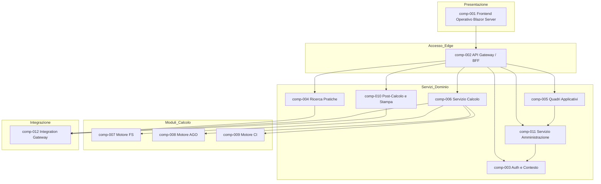

# logical_components

## component_catalog

| component_id | component_name | component_type | component_description | responsibility | owned_entities | supported_processes | related_feature_ids |
|---|---|---|---|---|---|---|---|
| comp-001 | Frontend Operativo Blazor Server | Layer | Layer di presentazione per operatori e ruoli amministrativi, orientato a maschere dati ricche e feedback immediato. | Rendere disponibili ricerca, quadri, calcolo, amministrazione e consultazione output in una UI coerente con il modello mentale degli operatori. | - | proc-001; proc-002; proc-003; proc-004; proc-005; proc-006; proc-007 | FEAT-001; FEAT-004; FEAT-007; FEAT-008; FEAT-011; FEAT-015; FEAT-018 |
| comp-002 | API Gateway / BFF | Gateway | Punto di ingresso unico per il frontend moderno, con composizione di risposte, protezione edge e compatibilità client. | Aggregare chiamate ai servizi di dominio, minimizzare round-trip UI e applicare policy cross-cutting lato edge. | - | proc-001; proc-002; proc-003; proc-004; proc-005; proc-006; proc-007 | FEAT-003; FEAT-016; FEAT-020 |
| comp-003 | Servizio Autenticazione e Contesto | Service | Servizio dedicato a identità federata, attivazione del contesto operativo, autorizzazioni e audit iniziale. | Trasformare identità INPS in contesto ruolo-sede utilizzabile dalle capability applicative. | ent-009; ent-025 | proc-001; proc-008 | FEAT-001; FEAT-002; FEAT-003 |
| comp-004 | Servizio Ricerca Pratiche | Service | Capability service per ricerca, disambiguazione, verifica lavorabilità e prenotazione della pratica. | Orchestrare accesso alla pratica da lavorare garantendo coerenza fra ricerca, presa in carico e normalizzazione. | ent-001; ent-002; ent-005; ent-010 | proc-002 | FEAT-004; FEAT-005; FEAT-006 |
| comp-005 | Servizio Quadri Applicativi | Service | Capability service che governa i quadri di pratica, i salvataggi transazionali e i controlli dinamici. | Preservare l’intero patrimonio funzionale dei quadri applicativi e la coerenza del contesto pratica. | ent-003; ent-006; ent-007; ent-008; ent-024 | proc-003 | FEAT-007; FEAT-008; FEAT-009; FEAT-010 |
| comp-006 | Servizio Calcolo | Service | Orchestratore della capability di verify e definitivo, responsabile del ciclo di vita del calcolo pensionistico. | Applicare prerequisiti, selezionare il motore di fondo corretto e consolidare gli esiti tecnici e funzionali. | ent-012; ent-014; ent-015; ent-018; ent-019 | proc-004; proc-005 | FEAT-011; FEAT-012; FEAT-013; FEAT-014 |
| comp-007 | Motore Calcolo FS | Module | Modulo specializzato per regole e formule del Fondo Speciale. | Eseguire calcoli e validazioni fondo-specifiche FS sotto il coordinamento del Servizio Calcolo. | ent-013; ent-017 | proc-004; proc-005 | FEAT-013; FEAT-014 |
| comp-008 | Motore Calcolo AGO | Module | Modulo specializzato per regole e formule dell’Assicurazione Generale Obbligatoria. | Eseguire calcoli e validazioni fondo-specifiche AGO sotto il coordinamento del Servizio Calcolo. | ent-013; ent-017 | proc-004; proc-005 | FEAT-013; FEAT-014 |
| comp-009 | Motore Calcolo CI | Module | Modulo specializzato per regole e formule delle Convenzioni Internazionali. | Eseguire calcoli e validazioni fondo-specifiche CI sotto il coordinamento del Servizio Calcolo. | ent-013; ent-017 | proc-004; proc-005 | FEAT-013; FEAT-014 |
| comp-010 | Servizio Post-Calcolo e Stampa | Service | Capability service per produzione PDF, deposito documentale, consultazione e ristampa output. | Trasformare un definitivo consolidato in output finali consultabili e in aggiornamenti post-calcolo tracciati. | ent-016; ent-021; ent-022 | proc-006 | FEAT-015; FEAT-016; FEAT-017 |
| comp-011 | Servizio Amministrazione | Service | Capability service per interventi amministrativi, configurazioni runtime, bypass controlli e audit applicativo. | Governare eccezioni di processo e configurazioni amministrative mantenendo controllo e tracciabilità. | ent-011; ent-023; ent-025; ent-026; ent-027 | proc-007; proc-008 | FEAT-018; FEAT-019 |
| comp-012 | Integration Gateway | Gateway | Gateway di integrazione verso WebDom, ARCA, SCRIWO, host DB2 e adapter di compatibilità legacy WCF. | Isolare protocolli eterogenei e contratti legacy dal core modernizzato, preservando continuità operativa. | ent-020; ent-021 | proc-002; proc-005; proc-006; proc-008 | FEAT-006; FEAT-016; FEAT-020 |

## component_interfaces

| component_id | interface_id | interface_direction | interface_name | interface_description | data_entities |
|---|---|---|---|---|---|
| comp-001 | if-001 | Provided | Portale operativo IVS | Espone maschere di login, ricerca, quadri, calcolo, amministrazione e consultazione output. | ent-001; ent-003; ent-009; ent-015; ent-022 |
| comp-001 | if-002 | Required | API BFF operatore | Richiede endpoint aggregati per contesto, pratica, quadri, calcolo e post-calcolo. | ent-009; ent-001; ent-015; ent-022 |
| comp-002 | if-003 | Provided | Frontend Composition API | Espone endpoint HTTPS ottimizzati per il frontend e applica policy edge. | ent-009; ent-001; ent-003; ent-015; ent-022 |
| comp-002 | if-004 | Required | API di dominio IVS | Richiede le API dei servizi di autenticazione, pratiche, quadri, calcolo, output e amministrazione. | ent-009; ent-001; ent-003; ent-012; ent-022 |
| comp-003 | if-005 | Provided | API Sessione e Contesto | Espone autenticazione applicativa, selezione contesto e autorizzazioni ruolo-sede. | ent-009; ent-025 |
| comp-003 | if-006 | Required | Federation callback | Richiede token e claims dal provider di identità federata INPS. | ent-009 |
| comp-004 | if-007 | Provided | API Ricerca e Acquisizione | Espone ricerca multi-criterio, disambiguazione e prenotazione pratica. | ent-001; ent-002; ent-005; ent-010 |
| comp-004 | if-008 | Required | Connettori WebDom e ARCA | Richiede integrazioni per metadati domanda, prenotazione e allineamento anagrafico. | ent-002; ent-005; ent-020; ent-021 |
| comp-005 | if-009 | Provided | API Quadri e Controlli | Espone quadri applicativi, salvataggio, controlli dinamici e stato semafori. | ent-003; ent-007; ent-008; ent-024 |
| comp-005 | if-010 | Required | Configurazioni runtime controlli | Richiede regole attive, bypass autorizzati e configurazioni amministrative. | ent-023; ent-024; ent-026 |
| comp-006 | if-011 | Provided | API Calcolo Verify/Definitivo | Espone l’avvio del verify, del definitivo e la lettura degli esiti di calcolo. | ent-012; ent-014; ent-015; ent-019 |
| comp-006 | if-012 | Required | Invocazione motori fondo | Richiede l’uso dei moduli di calcolo FS, AGO e CI e delle integrazioni obbligatorie. | ent-013; ent-017; ent-020; ent-021 |
| comp-007 | if-013 | Provided | Regole Fondo FS | Espone algoritmi e verifiche specialistiche del fondo FS. | ent-013; ent-017 |
| comp-008 | if-014 | Provided | Regole Fondo AGO | Espone algoritmi e verifiche specialistiche del fondo AGO. | ent-013; ent-017 |
| comp-009 | if-015 | Provided | Regole Fondo CI | Espone algoritmi e verifiche specialistiche del fondo CI. | ent-013; ent-017 |
| comp-010 | if-016 | Provided | API Output e Stampa | Espone generazione PDF, deposito documentale, consultazione e ristampa output. | ent-016; ent-021; ent-022 |
| comp-010 | if-017 | Required | Pubblicazione documenti e downstream | Richiede la propagazione verso SCRIWO e sistemi enterprise post-calcolo. | ent-020; ent-021; ent-022 |
| comp-011 | if-018 | Provided | API Amministrazione e Audit | Espone sblocco, riassegnazione, cambio stato, bypass e consultazione audit. | ent-011; ent-023; ent-025; ent-026; ent-027 |
| comp-011 | if-019 | Required | Policy configurative persistite | Richiede accesso a configurazioni versionate e policy di governance applicativa. | ent-023; ent-025; ent-026 |
| comp-012 | if-020 | Provided | Adapter enterprise e compatibilità | Espone adapter REST/WCF/DB2 verso sistemi enterprise e consumer legacy. | ent-020; ent-021; ent-022 |

## component_diagram

COMPONENTS_COMPLETED
