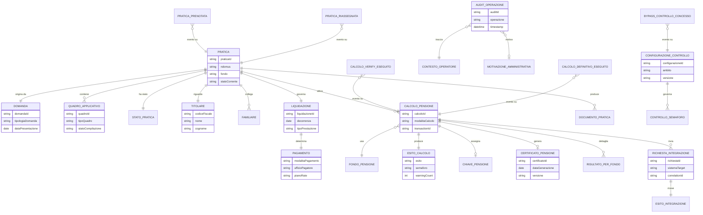

# logical_entities

## bounded_contexts

| context_id | context_name | context_description |
|---|---|---|
| ctx-001 | Gestione Pratiche | Contesto core che governa pratica, domanda, quadri applicativi, stato di lavorazione e presa in carico operativa. |
| ctx-002 | Calcolo Pensione | Contesto che orchestra verify e definitivo, chiave pensione, certificato e risultati differenziati per fondo FS, AGO e CI. |
| ctx-003 | Integrazione Enterprise | Contesto che presidia contratti verso WebDom, ARCA, SCRIWO, host DB2 e altri sistemi enterprise, includendo compatibilità transitoria. |
| ctx-004 | Amministrazione e Configurazione | Contesto di governo che copre audit trail, controlli dinamici, configurazioni amministrative, bypass e gestione delle eccezioni. |

## entities

| entity_id | entity_name | entity_type | bounded_context_id | entity_description | key_attributes | related_requirement_ids |
|---|---|---|---|---|---|---|
| ent-001 | Pratica | Aggregate Root | ctx-001 | Unità di lavoro pensionistica presa in carico da una sede INPS e governata per l’intero ciclo di liquidazione. | praticaId, ndomus, fondo, statoCorrente, sedeAssegnata, operatoreAssegnato, dataApertura | FR-005; FR-007; FR-008; FR-011; FR-020; FR-021 |
| ent-002 | Domanda | Domain Entity | ctx-001 | Istanza della domanda pensionistica acquisita da WebDom e arricchita con correlazioni e metadati di origine. | domandaId, tipologiaDomanda, dataPresentazione, canaleOrigine, metadatiWebDom, domandeCollegate | FR-005; FR-006; FR-008; FR-023 |
| ent-003 | QuadroApplicativo | Domain Entity | ctx-001 | Sezione compilabile della pratica che raccoglie dati anagrafici, tecnici o economici necessari alla liquidazione. | quadroId, tipoQuadro, fondoApplicabile, statoCompilazione, ultimaVersione, semaforo | FR-009; FR-010; FR-011; FR-012 |
| ent-004 | StatoPratica | Value Object | ctx-001 | Valore che descrive la posizione corrente della pratica nel workflow, compresi blocchi e condizioni di avanzamento. | codiceStato, descrizione, bloccante, dataAggiornamento | FR-007; FR-011; FR-021 |
| ent-005 | Titolare | Domain Entity | ctx-001 | Soggetto principale della pratica pensionistica, allineato ai dati anagrafici federati o provenienti da ARCA. | codiceFiscale, nome, cognome, dataNascita, datiAnagraficiAllineati | FR-005; FR-006; FR-009; FR-023 |
| ent-006 | Familiare | Domain Entity | ctx-001 | Familiare, avente diritto o soggetto collegato rilevante ai fini del calcolo e dei quadri applicativi. | familiareId, relazione, codiceFiscale, dataNascita, aventeDiritto | FR-009; FR-010 |
| ent-007 | Liquidazione | Domain Entity | ctx-001 | Raccoglie gli elementi tecnico-economici della liquidazione da sottoporre ai controlli e ai motori di calcolo. | liquidazioneId, decorrenza, tipoPrestazione, contributiRilevanti, maggiorazioni, benefici | FR-010; FR-011; FR-012; FR-014 |
| ent-008 | Pagamento | Domain Entity | ctx-001 | Descrive coordinate, modalità e riferimenti del pagamento da propagare verso i sistemi downstream. | pagamentoId, modalitaPagamento, ufficioPagatore, ibanMascherato, pianoRate | FR-010; FR-014; FR-024 |
| ent-009 | ContestoOperatore | Value Object | ctx-001 | Contesto operativo attivo composto da identità federata, ruolo, sede e matricola visibile in sessione. | utenteId, ruoloId, sedeId, matricola, timestampAttivazione | FR-001; FR-002; FR-003; FR-004 |
| ent-010 | PraticaPrenotata | Domain Event | ctx-001 | Evento emesso quando una domanda è prenotata correttamente e la pratica viene assegnata all’operatore. | eventoId, praticaId, operatoreId, sedeId, timestamp, originePrenotazione | FR-007; FR-008 |
| ent-011 | PraticaRiassegnata | Domain Event | ctx-001 | Evento che registra il cambio di assegnazione o di stato amministrativo di una pratica. | eventoId, praticaId, daOperatore, aOperatore, motivo, timestamp | FR-021; FR-022 |
| ent-012 | CalcoloPensione | Aggregate Root | ctx-002 | Rappresenta il ciclo di vita del verify o del definitivo con routing di fondo, prerequisiti e stato tecnico della transazione. | calcoloId, praticaId, modalitaCalcolo, fondo, statoEsecuzione, transactionId | FR-013; FR-014; FR-015; FR-016 |
| ent-013 | FondoPensione | Value Object | ctx-002 | Identifica il fondo pensionistico di riferimento e le relative varianti di quadro e prerequisiti di calcolo. | codiceFondo, descrizione, variantiQuadro, prerequisitiCalcolo | FR-012; FR-015 |
| ent-014 | ChiavePensione | Value Object | ctx-002 | Identificativo tecnico univoco della pensione prodotto al completamento del calcolo. | chiave, fondo, annoEsercizio, progressivo | FR-016 |
| ent-015 | EsitoCalcolo | Value Object | ctx-002 | Valore di risposta del motore di calcolo che sintetizza warning, errori, semafori e stato della pensione. | esito, warningCount, errorCount, semaforo, messaggioSintetico | FR-013; FR-014; FR-016 |
| ent-016 | CertificatoPensione | Domain Entity | ctx-002 | Output strutturato del calcolo contenente certificato, estremi e riferimenti per la stampa finale. | certificatoId, tipo, dataGenerazione, versione, contenutoRiferito | FR-013; FR-017 |
| ent-017 | RisultatoPerFondo | Domain Entity | ctx-002 | Dettaglio di risultato specifico per il fondo selezionato, con importi e note di calcolo. | risultatoId, fondo, importoLordo, decorrenza, noteCalcolo | FR-015; FR-016 |
| ent-018 | CalcoloVerifyEseguito | Domain Event | ctx-002 | Evento generato al termine di un verify non consolidante. | eventoId, calcoloId, praticaId, esito, timestamp, transactionId | FR-013; FR-016 |
| ent-019 | CalcoloDefinitivoEseguito | Domain Event | ctx-002 | Evento generato al termine del definitivo con consolidamento e attivazione del post-calcolo. | eventoId, calcoloId, praticaId, chiavePensione, timestamp, statoConsolidamento | FR-014; FR-016; FR-018 |
| ent-020 | RichiestaIntegrazione | Domain Entity | ctx-003 | Rappresenta una richiesta verso sistemi enterprise o adapter legacy, con capability e correlation-id. | richiestaId, sistemaTarget, capability, payloadSintetico, correlationId, statoRichiesta | FR-008; FR-023; FR-024; FR-025 |
| ent-021 | EsitoIntegrazione | Value Object | ctx-003 | Esito tecnico-funzionale di una chiamata verso WebDom, ARCA, host o sistemi downstream. | codiceEsito, descrizione, bloccante, tempoRisposta, riferimentoEsterno | FR-014; FR-018; FR-024; FR-025 |
| ent-022 | DocumentoPratica | Domain Entity | ctx-003 | Documento o PDF emesso per la pratica e pubblicato verso SCRIWO o sistemi documentali equivalenti. | documentoId, tipoDocumento, formato, canaleDeposito, dataPubblicazione | FR-017; FR-018; FR-019 |
| ent-023 | ConfigurazioneControllo | Aggregate Root | ctx-004 | Configurazione versionata dei controlli dinamici, delle abilitazioni e delle eccezioni amministrative. | configurazioneId, ambito, fondo, regola, abilitata, versione | FR-012; FR-022 |
| ent-024 | ControlloSemaforo | Domain Entity | ctx-004 | Esito analitico di un controllo dinamico o di un semaforo di avanzamento applicato a quadro o calcolo. | controlloId, codiceRegola, severita, esito, messaggioOperatore, quadroRiferimento | FR-012; FR-016; FR-022 |
| ent-025 | AuditOperazione | Domain Entity | ctx-004 | Traccia immutabile delle operazioni sensibili, utile a conformità, supporto tecnico e governance. | auditId, operazione, ruolo, sede, timestamp, payloadSintetico | FR-004; FR-014; FR-018; FR-021; FR-022 |
| ent-026 | MotivazioneAmministrativa | Value Object | ctx-004 | Giustificazione obbligatoria per sblocchi, riassegnazioni, bypass o cambi stato amministrativi. | motivazioneCodice, testo, autore, dataInserimento | FR-020; FR-021; FR-022 |
| ent-027 | BypassControlloConcesso | Domain Event | ctx-004 | Evento di governance emesso quando un controllo dinamico viene bypassato con autorizzazione valida. | eventoId, praticaId, controlloId, motivazione, autorizzatore, timestamp | FR-022 |

## entity_relationships

| relationship_id | source_entity_id | target_entity_id | relationship_type | relationship_description |
|---|---|---|---|---|
| rel-001 | ent-001 | ent-002 | 1:1 | Ogni pratica operativa nasce da una domanda selezionata e normalizzata. |
| rel-002 | ent-001 | ent-003 | 1:N | Una pratica contiene più quadri applicativi compilati nel tempo. |
| rel-003 | ent-001 | ent-004 | 1:1 | La pratica espone sempre uno stato corrente di lavorazione. |
| rel-004 | ent-001 | ent-005 | 1:1 | Ogni pratica ha un titolare principale di riferimento. |
| rel-005 | ent-001 | ent-006 | 1:N | Una pratica può avere più familiari o aventi diritto collegati. |
| rel-006 | ent-001 | ent-007 | 1:1 | La pratica mantiene un set coerente di dati di liquidazione. |
| rel-007 | ent-007 | ent-008 | 1:1 | La liquidazione determina le modalità di pagamento della pensione. |
| rel-008 | ent-001 | ent-012 | 1:N | Su una pratica possono essere eseguiti più calcoli verify e definitivo. |
| rel-009 | ent-012 | ent-013 | N:1 | Ogni calcolo è instradato verso un solo fondo pensionistico. |
| rel-010 | ent-012 | ent-014 | 1:0..1 | Il definitivo produce una chiave pensione solo a consolidamento riuscito. |
| rel-011 | ent-012 | ent-015 | 1:1 | Ogni esecuzione di calcolo produce un esito sintetico e tracciabile. |
| rel-012 | ent-012 | ent-016 | 1:0..1 | Il calcolo può generare un certificato pensionistico associato. |
| rel-013 | ent-012 | ent-017 | 1:N | Il calcolo raccoglie risultati dettagliati specifici del fondo elaborato. |
| rel-014 | ent-012 | ent-020 | 1:N | Il calcolo apre richieste di integrazione verso sistemi enterprise e adapter. |
| rel-015 | ent-020 | ent-021 | 1:1 | Ogni richiesta di integrazione produce un esito tecnico-funzionale. |
| rel-016 | ent-001 | ent-022 | 1:N | La pratica può accumulare più documenti, PDF o output ristampabili. |
| rel-017 | ent-023 | ent-024 | 1:N | Una configurazione di controllo governa più esiti di semaforo e regole runtime. |
| rel-018 | ent-025 | ent-009 | N:1 | Ogni audit è riferito al contesto operativo con ruolo e sede attivi. |
| rel-019 | ent-025 | ent-026 | N:0..1 | Le operazioni amministrative possono richiedere una motivazione esplicita. |
| rel-020 | ent-010 | ent-001 | Event | L’evento di prenotazione segnala l’avvenuta presa in carico della pratica. |
| rel-021 | ent-011 | ent-001 | Event | L’evento di riassegnazione aggiorna ownership o stato della pratica. |
| rel-022 | ent-018 | ent-012 | Event | L’evento di verify chiude un ciclo di simulazione non consolidante. |
| rel-023 | ent-019 | ent-012 | Event | L’evento di definitivo chiude il ciclo di calcolo consolidato. |
| rel-024 | ent-027 | ent-023 | Event | L’evento di bypass attesta l’applicazione di una configurazione eccezionale. |

## entity_relationship_diagram

ENTITIES_COMPLETED
