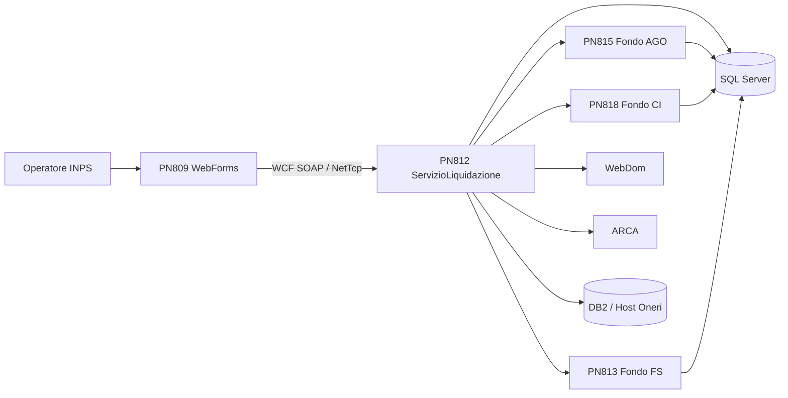

# Deep Dive - Progetto IVS_DNA

## 1. Executive Summary
IVS_DNA è una piattaforma legacy INPS per la liquidazione delle pensioni articolata su cinque macro-moduli: una Web UI WebForms (`PN809`), un orchestratore WCF (`PN812`) e tre servizi specializzati per fondo (`PN813` FS, `PN815` AGO, `PN818` CI). L’architettura è coerente con un modello SOA intra-enterprise di fine anni 2000: .NET Framework 3.5, WCF SOAP, LINQ-to-SQL, SQL Server, integrazioni DB2/mainframe e framework proprietario `INPS.DNA`.

L’analisi del repository mostra una codebase ampia, fortemente configurabile via `appSettings` e controlli dinamici, ma anche caratterizzata da accoppiamento elevato, ampia esposizione di credenziali in chiaro, assenza di pipeline CI/CD, uso massivo di stato server-side (`Session`, `ViewState`) e forte dipendenza da tecnologie EOL. Non emergono elementi per una riscrittura “big bang” a basso rischio; il percorso raccomandato è una modernizzazione incrementale per capability, partendo da hardening sicurezza, osservabilità e segmentazione contrattuale.

## 2. Project Structure
### 2.1 Repository Organization
| Percorso | Ruolo |
|---|---|
| `PN809/` | Frontend operatore ASP.NET WebForms + pattern MVP |
| `PN812/` | Orchestratore WCF centrale, BL, BLCommon, Data, DataCommon, test |
| `PN813/` | Servizio WCF Fondo FS |
| `PN815/` | Servizio WCF Fondo AGO |
| `PN818/` | Servizio WCF Fondo CI |
| `Doc/` | Analisi tecnica, onboarding, requisiti e manuale utente |
| `docs/` | Deliverable IMPACT generati in questa esecuzione |

### 2.2 Build Artifacts
- Soluzioni Visual Studio 2010 (`Format Version 11.00`) per ciascun macro-modulo.
- Web application project legacy con target `.NET Framework v3.5`.
- Librerie esterne distribuite in cartelle locali (`dll_esterne`) e riferimenti proprietari `INPS.DNA`.
- Data model LINQ-to-SQL in `Pensioni.dbml`, `WebDom.dbml`, `CIBase.dbml`.

### 2.3 Branching Strategy
- **Branch corrente repository Git:** `main`.
- **Processo di branching documentato:** TBD.
- **Evidenza storica:** le soluzioni contengono metadati `SubversionScc`, `AnkhSVN` e `SerenaSourceControl`, segnale di una probabile migrazione da SCM legacy verso Git.

## 3. Technology Stack
### 3.1 Backend Stack
| Area | Evidenza | Osservazioni |
|---|---|---|
| Runtime | `.csproj` con `TargetFrameworkVersion v3.5` | Tecnologia EOL / legacy |
| Servizi | WCF SOAP (`.svc`, `ServiceContract`, `OperationContract`) | Contratti molto ampi |
| Business Logic | Classi `Gestione*` in PN812/813/815/818 | Dominio ricco ma accoppiato |
| Data Access | LINQ-to-SQL, `PensioniDataContext` | ORM legacy, forte legame con schema DB |
| Transazioni | `TransactionScopeFactory.Create(...)` | Transazioni pervasive |
| JSON/aux | `Newtonsoft.Json 9.0.0.0` | Uso tattico, non architettura REST-native |

### 3.2 Frontend Stack
| Area | Evidenza | Osservazioni |
|---|---|---|
| UI | ASP.NET WebForms | 112 pagine `.aspx`, 190 user control |
| Pattern UI | Presenter + IView | MVP classico, senza DI |
| State management | `SessionState StateServer`, `ViewState` | Stato molto distribuito, difficile da testare |
| Rendering | Master page + theme (`BlueINPS1`, `iFrame`, `SistemaUnico`) | Modernizzazione UI parziale ma non SPA |
| Report | Microsoft ReportViewer 9 | Dipendenza da stack report legacy |

### 3.3 Database & Persistence
| Area | Evidenza | Osservazioni |
|---|---|---|
| Primary DB | `PensioniConnectionString`, SQL Server | Base dati transazionale principale |
| Secondary DB | `WebDomConnectionString`, `DBS_ComuniConnectionString` | Supporto a decodifiche e fonti complementari |
| Host / mainframe | `DB2Conn_Oneri` via `Microsoft.HostIntegration.MsDb2Client` | Dipendenza da ecosistema IBM |
| Modello dati | `Pensioni.dbml`, `WebDom.dbml`, `CIBase.dbml` | Mix tra tabelle operative e decodifiche |

### 3.4 Infrastructure & DevOps
| Area | Evidenza | Osservazioni |
|---|---|---|
| Hosting | Web application IIS (`UseIIS=True`) | Deploy on-prem/intranet |
| Environment mgmt | `Web.config`, `CHGTEST`, `CHGCOLL`, `CHGESERCIZIO` | Varianti manuali per ambiente |
| Auth platform | `INPS.DNA`, `IdmSimulator`, `AuthenticationHttpModule` | Sicurezza enterprise proprietaria |
| CI/CD | Nessun workflow o pipeline nel repo | Processo presumibilmente manuale |
| Monitoring | Endpoint `test` / `IMonitoringService` in config PN812 | Osservabilità minima e frammentata |

## 4. Architecture Overview
### 4.1 Application Architecture Pattern
- **PN809** implementa un frontend server-side, stato-centrico, per operatori di sede.
- **PN812** espone un unico contratto WCF centrale (`IServizioLiquidazione`) che aggrega funzionalità comuni e smista la logica verso i moduli di fondo.
- **PN813/PN815/PN818** implementano logica specializzata per FS, AGO e CI con pattern ricorrente Service → BL → Data/host adapter.

### 4.2 Communication Patterns

### 4.3 Data Architecture
- Dati pensione e “quadri” memorizzati su SQL Server tramite DataContext LINQ-to-SQL.
- Decodifiche e tabelle di supporto in `WebDom.dbml` e `DBS_Comuni`.
- Integrazioni host/DB2 per oneri e sistemi legacy.
- Uso di stored procedure per operazioni critiche e insert massivi (es. `InsertPensione`).

### 4.4 Frontend Architecture
- Ogni schermata rilevante è composta da pagina `.aspx.cs` che implementa una `IView`, presenter dedicato e user control specializzati.
- Il contesto applicativo è mantenuto soprattutto in `Session` con chiavi stringa e `ViewState` dei controlli.
- La navigazione è guidata da step funzionali: ricerca → conferma/prelievo → compilazione quadri → verify → definitivo → stampa.

## 5. Project Metrics
| Metrica | Valore | Note |
|---|---:|---|
| Soluzioni Visual Studio | 5 | PN809, PN812, PN813, PN815, PN818 |
| Progetti `.csproj` | 34 | Soluzione multi-progetto legacy |
| File C# totali | 2.007 | Include codice generato e proxy |
| LOC C# (safe count) | 667.010 | `find -print0 | xargs -0 wc -l` |
| LOC C# stimate hand-written | 630.434 | Escluse cartelle `bin/`, `obj/`, proxy generati e `*.designer.cs` |
| File `.aspx` | 112 | UI WebForms |
| File `.ascx` | 190 | User controls |
| Presenter PN809 | 71 | Pattern MVP |
| IView PN809 | 83 | Contratti vista |
| Operazioni WCF in `IServizioLiquidazione` | 252 | Contratto centrale PN812 |
| Test unitari PN812 | 42 file | MSTest |
| Service test PN812 | 6 file | Test WCF legacy |
| Uso `Session[` in PN809 | 1.805 | Forte stato conversazionale |
| Uso `ViewState[` in PN809 | 3.344 | Forte dipendenza da WebForms |
| File backend con `TransactionScope` | 252 | Persistenza transazionale molto diffusa |
| Marker TODO/FIXME/HACK | 150 | Indicatore di debito tecnico |

## 6. Team & Development Process
- Non esiste nel repo una descrizione esplicita del processo di delivery; la documentazione di onboarding suggerisce un contesto di team operativo cross-modulo con competenze su UI, orchestrazione, servizi fondo e integrazioni host.
- La documentazione consiglia smoke test minimi su: ricerca, prelievo, calcolo verify, calcolo definitivo, stato pratica.
- La presenza di configurazioni `CHG*`, ruoli differenziati e test con identità mock indica un processo fortemente centrato su ambienti interni e utenti di sede.

## 7. Integrations & Dependencies
### 7.1 External Systems
| Sistema | Ruolo |
|---|---|
| WebDom | Fonte domande e metadati di lavorazione |
| ARCA | Anagrafica centralizzata |
| FELPE | Aggiornamento / controllo dominio pensionistico |
| ANF | Consultazione unificata familiari |
| SAI | Sistema Addebiti INPS |
| INPDAP | Dati previdenziali ex gestione pubblica |
| SCRIWO | Document management / allegati |
| DB2 Oneri | Oneri, host e mainframe legacy |
| Hermes | Messaggi operativi |

### 7.2 Third-Party / Enterprise Services
- Framework proprietario `INPS.DNA` per hosting, sicurezza, logging e context handling.
- Enterprise Library 4.1.
- Newtonsoft.Json 9.
- Microsoft ReportViewer 9.
- Polly 4.3 lato UI.

## 8. Security & Compliance
### 8.1 Authentication & Authorization
- Autenticazione applicativa delegata alla piattaforma INPS (`INPS.DNA`, IDM, `AuthenticationHttpModule`).
- Modello ruoli/sede: operatore, amministratore, direttore/capo processo con differenze per fondo.
- Autorizzazione applicativa ulteriormente rafforzata in codice e tramite configurazioni/controlli dinamici.

### 8.2 Data Protection
- **Rischio elevato:** numerose credenziali e secret applicativi in chiaro nei `Web.config` e nelle varianti `CHG*`.
- `connectionStringCryptography enabled="false"` sia in PN809 sia in PN812.
- `debug="true"` in configurazione base; nessuna evidenza nel repo di segretazione centralizzata.

### 8.3 Compliance Requirements
- Dominio con dati personali e previdenziali sensibili; sono implicite esigenze GDPR e audit trail.
- Nel codice/repo non sono presenti policy formali di retention, masking o cifratura end-to-end: **TBD**.

## 9. Deployment & Operations
### 9.1 Deployment Target
- Applicazione web e servizi WCF destinati ad ambienti intranet Windows/IIS.
- URL locali di sviluppo configurati su `http://localhost/...`.
- Endpoints WCF su `customBinding`, `nettcp`, `netpipe`, e MEX.

### 9.2 Configuration Management
- Ogni modulo espone almeno quattro file di configurazione ambiente (`Web.config`, `CHGTEST`, `CHGCOLL`, `CHGESERCIZIO`).
- Le varianti configurano database, API interne, host CICS, chiavi applicative e identity key.
- Dipendenza anche da file esterni `C:\DNA.Runtime\Configuration Files\...` non versionati nel repository.

### 9.3 Monitoring & Observability
- Logging centralizzato tramite `INPS.DNA.Logging.Logger`, log SOAP e log generici applicativi.
- Endpoint `IMonitoringService` esposto in configurazione PN812.
- Non sono visibili nel repo dashboard, allarmi, APM, correlazione request-id o log aggregation moderna.

## 10. Documentation Inventory
| Documento | Copertura |
|---|---|
| `Legacy_IVS_AnalisiTecnica.md` | Architettura, flussi, fondi, integrazioni |
| `IVS_Onboarding_Tecnico.md` | Ingresso team, troubleshooting, best practice |
| `IVS_Requisiti_Tecnici_Approfonditi.md` | RF/RI/RNF/RS/RO e backlog tecnico |
| `Manuale_utente.md` | Manuale funzionale dettagliato operatore |
| `README.md` | Minimo, non sufficiente per onboarding |

## 11. Critical Observations
### 🔴 HIGH PRIORITY ISSUES
1. Credenziali e secret applicativi in chiaro nei file di configurazione.
2. Forte dipendenza da tecnologie legacy/EOL: WebForms, WCF, LINQ-to-SQL, .NET 3.5.
3. Contratto WCF centrale estremamente ampio (252 operation) con alto impatto di cambiamento.
4. Configurazione manuale multi-ambiente senza pipeline automatizzata.
5. Forte uso di `Session` e `ViewState`, con impatto su performance, testabilità e manutenibilità.

### 🟠 MEDIUM PRIORITY CONCERNS
1. Duplicazione concettuale della logica fra fondi FS/AGO/CI.
2. Dipendenza da numerosi servizi interni e host legacy con failure modes non sempre espliciti.
3. Osservabilità incompleta e metriche operative non codificate.
4. Asset statici e compatibilità browser focalizzati su contesto legacy (`IE=9`).

### 🟢 POSITIVE FINDINGS
1. Separazione logica per fondo e presenza di un orchestratore unico rendono leggibile il perimetro funzionale.
2. Documentazione tecnica interna già discreta rispetto alla media dei sistemi legacy.
3. Presenza di test unitari e service test su PN812, pur non esaustivi.
4. Modellazione dati esplicita via DBML, utile per reverse engineering.

## 12. Technology Radar
### 🚨 EOL/Deprecated Technologies
- .NET Framework 3.5
- ASP.NET WebForms
- WCF SOAP come paradigma principale
- LINQ-to-SQL / DBML
- ReportViewer 9

### ⚠️ Near EOL / High Maintenance
- Enterprise Library 4.1
- Modello di configurazione basato su file environment-specifici
- Integrazioni DB2/mainframe proprietarie

### ✅ Current / Reusable Concepts
- Segmentazione per capability/fondo
- Contratti espliciti `Area*` / `AreaEsito`
- Logging e audit legacy come base per un modello di osservabilità evoluto

## 13. Next Steps
1. Secret management e bonifica configurazioni sensibili.
2. Inventario endpoint/consumatori reali del contratto `IServizioLiquidazione`.
3. Baseline di smoke test automatizzabili sui flussi core.
4. Refactoring preparatorio: estrazione capability-oriented di PN812.
5. Strategia di modernizzazione incrementale UI + backend, senza big bang.

## Appendix A: Tool Commands Used
- `find /root/IVS_DNA -name "*.cs" -print0 | xargs -0 wc -l | tail -1`
- `find PN809 -name '*.aspx' | wc -l`
- `find PN809 -name '*.ascx' | wc -l`
- `grep -R --include='*.cs' -o 'Session\[' PN809 | wc -l`
- `grep -R --include='*.cs' -o 'ViewState\[' PN809 | wc -l`
- `grep -c '\[OperationContract\]' PN812/WSInpsPensioniLiquidazione/Contracts/ServiceContracts/IServizioLiquidazione.cs`

## Appendix B: File Paths Reference
### Fonti di evidenza principali
- `PN809/LiquidazionePensioniFS/*.aspx`, `*.ascx`, `*.aspx.cs`
- `PN809/LiquidazionePensioniFS.Presenter/*`
- `PN812/WSInpsPensioniLiquidazione/*.svc.cs`, `Contracts/*`, `Web.config`
- `PN812/WSInpsPensioniLiquidazione.BL/*`, `PN812/WSInpsPensioniLiquidazione.DataCommon/*`
- `PN813/WSInpsPensioniLiquidazioneFS/*`
- `PN815/WSInpsPensioniLiquidazioneAgo/*`
- `PN818/WSInpsPensioniLiquidazioneCi/*`

## Reference Documents
- `/root/IVS_DNA/README.md`
- `/root/IVS_DNA/Doc/Legacy_IVS_AnalisiTecnica.md`
- `/root/IVS_DNA/Doc/IVS_Onboarding_Tecnico.md`
- `/root/IVS_DNA/Doc/IVS_Requisiti_Tecnici_Approfonditi.md`
- `/root/IVS_DNA/Doc/Manuale_utente.md`
- `PN809/LiquidazionePensioniFS/Web.config`
- `PN812/WSInpsPensioniLiquidazione/Web.config`
- `PN812/WSInpsPensioniLiquidazione/Contracts/ServiceContracts/IServizioLiquidazione.cs`

## Change Log
- 2026-06-24 — Documento generato da analisi del repository, dei file di configurazione e della documentazione tecnica esistente.
