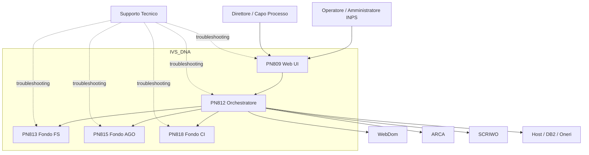

# Context - Progetto IVS_DNA

## 1. Cos'è il Sistema?
### 1.1 Overview
IVS_DNA è il sistema legacy INPS per la liquidazione iniziale delle pensioni. Supporta l’intero ciclo di lavorazione di una pratica: ricerca, presa in carico, compilazione dei quadri dati, verifica, calcolo definitivo, stampa e attività amministrative post-calcolo.

### 1.2 Dominio Applicativo
Il dominio copre tre aree previdenziali distinte:
- **FS** — Fondo Speciale / Gestione pubblica.
- **AGO** — Assicurazione Generale Obbligatoria.
- **CI** — Convenzioni Internazionali.

### 1.3 Acronimi e Nomenclatura
| Termine | Significato |
|---|---|
| NDomus / NumeroDomanda | Identificativo della pratica pensionistica |
| Quadri | Sezioni funzionali della pratica |
| Verify | Calcolo di verifica non definitivo |
| Definitivo | Calcolo finale con consolidamento stato |
| PN809 | Frontend WebForms |
| PN812 | Orchestratore WCF |
| PN813 / PN815 / PN818 | Servizi fondo FS / AGO / CI |

## 2. Scope del Sistema
### 2.1 Funzionalità Principali (In Scope)
- Autenticazione utente e selezione ruolo/sede.
- Ricerca pratica per numero domanda, CF o anagrafica.
- Visualizzazione stato pratica.
- Prelievo/prenotazione domanda e consultazione.
- Compilazione e salvataggio dei quadri applicativi.
- Calcolo pensione in modalità verify e definitiva.
- Produzione della stampa finale e aggiornamenti verso sistemi esterni.
- Funzioni amministrative (sblocco, cambio stato, riassegnazione, eliminazione, bypass controlli).

### 2.2 Fuori Scope (Out of Scope)
- Canali self-service cittadino completi.
- Gestione documentale general purpose indipendente da SCRIWO.
- Procedure di pagamento esterne ai dati/uffici pagatori esposti dal sistema.
- Governance infrastrutturale completa e procedure DR, non presenti nel repository.

### 2.3 System Boundaries
Il sistema non è autonomo: dipende da piattaforme INPS per identità, anagrafica, domande, host e sistemi di supporto. Il confine del repository include la logica applicativa, non l’intero ecosistema operativo.

## 3. Contesto Organizzativo e Sistemico
### 3.1 Processo Business Supportato
Il processo supportato è la liquidazione iniziale di pensione da parte di operatori di sede. La pratica viene identificata, acquisita, arricchita con dati anagrafici/contributivi/economici, verificata e calcolata, quindi consolidata e stampata.

### 3.2 Landscape Sistemico
#### Sistemi Upstream (Data Providers)
- **WebDom**: fornisce domande e metadati di richiesta.
- **ARCA**: anagrafica e allineamento dati soggetti.
- **DB2/Oneri**: dati oneri e host legacy.
- **INPDAP / GP4 / host fondi**: dati specialistici per alcuni fondi.

#### Sistemi Downstream (Data Consumers)
- **SCRIWO**: contenuti e documenti correlati.
- **StampeWeb / certificati**: produzione output ufficiali.
- **Sistemi di monitoraggio interni DNA**: configurazione/monitoring di base.

#### Sistemi Integrati (Peer-to-Peer)
- FELPE, SAI, ANF, Redditi, Uffici Pagatori, CI05, Total IVS, NACI, SIN.

### 3.3 Contesto Organizzativo
Gli utenti primari sono operatori interni INPS con ruoli differenziati per fondo e responsabilità. La documentazione di onboarding suggerisce un contesto organizzativo in cui il troubleshooting viene distribuito tra frontend, orchestratore e servizi fondo.

## 4. Utenti del Sistema
### 4.1 Utenti Primari
#### Utente Tipo 1: Operatore di sede
- Cerca pratiche.
- Compila quadri.
- Esegue verify e calcolo definitivo.
- Consulta esiti e stampa.

#### Utente Tipo 2: Amministratore applicativo
- Gestisce sblocchi, riassegnazioni, tipologie non abilitate, controlli dinamici.
- Accede a funzioni batch e di manutenzione applicativa.

### 4.2 Utenti Secondari
- **Direttore / Capo processo**: governance di alcune azioni sensibili.
- **Supporto tecnico applicativo**: triage su issue di flusso o integrazione.
- **Manutentori legacy**: interventi chirurgici su moduli PN809/PN812/PN813/PN815/PN818.

### 4.3 External Actors
- ARCA, WebDom, host DB2, SAI, FELPE, SCRIWO, INPDAP, ANF, Redditi.
- Piattaforma `INPS.DNA` come attore infrastrutturale abilitante.

## 5. Motivazione e Valore
### 5.1 Business Drivers
- Gestire la liquidazione pensionistica istituzionale in modo coerente e tracciabile.
- Coprire fondi previdenziali eterogenei in un’unica esperienza operatore.
- Ridurre la frammentazione operativa tra sistemi interni legacy.

### 5.2 Technical Drivers
- Riutilizzare servizi, host e framework enterprise esistenti.
- Preservare retrocompatibilità verso consumatori e processi interni.
- Governare differenze di fondo tramite orchestrazione centralizzata.

### 5.3 Compliance e Regulatory Drivers
- Trattamento di dati previdenziali/personali sensibili.
- Necessità di auditabilità delle azioni utente.
- Esigenze implicite di conformità interna INPS/GDPR: dettagli formali nel repo non disponibili (**TBD**).

## 6. Context Diagram

## 7. Considerazioni Finali
### 7.1 Punti di Attenzione
- Il sistema è profondamente dipendente dall’ecosistema intranet INPS.
- Molti dettagli organizzativi e di governance non sono nel repository; vanno validati con stakeholder.
- La modernizzazione deve rispettare ruoli, audit e vincoli di continuità operativa.

### 7.2 Success Criteria
- Mappatura chiara di attori, scope e dipendenze.
- Distinzione netta tra capacità comuni e fondo-specifiche.
- Riconoscimento esplicito di ciò che è noto dal codebase e di ciò che resta TBD.

## Reference Documents
- `/root/IVS_DNA/README.md`
- `/root/IVS_DNA/Doc/Legacy_IVS_AnalisiTecnica.md`
- `/root/IVS_DNA/Doc/IVS_Onboarding_Tecnico.md`
- `/root/IVS_DNA/Doc/IVS_Requisiti_Tecnici_Approfonditi.md`
- `/root/IVS_DNA/Doc/Manuale_utente.md`
- `PN809/LiquidazionePensioniFS/Web.config`
- `PN812/WSInpsPensioniLiquidazione/Web.config`
- `PN812/WSInpsPensioniLiquidazione/Contracts/ServiceContracts/IServizioLiquidazione.cs`

## Change Log
- 2026-06-24 — Documento generato da analisi del repository, dei file di configurazione e della documentazione tecnica esistente.
