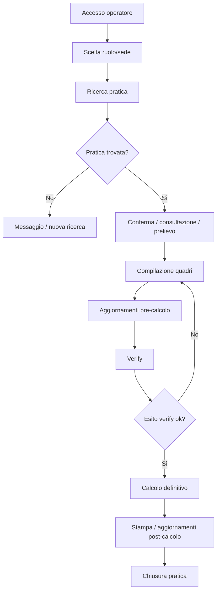

# Functional Overview - Progetto IVS_DNA

## 1. User Types & Personas
| Persona | Obiettivo | Touchpoint principali |
|---|---|---|
| Operatore di sede | Lavorare una pratica pensionistica end-to-end | Ricerca, quadri, verify, definitivo, stampa |
| Amministratore | Gestire eccezioni e configurazioni operative | Utility di sistema, sblocchi, bypass, liquidazioni abilitate |
| Direttore / Capo processo | Autorizzare o supervisionare attività sensibili | Cambio stato, eliminazioni, riassegnazioni |
| Supporto applicativo | Diagnosticare errori cross-modulo | Log SOAP, log generici, config, test service |

## 2. Core Use Cases
| ID | Caso d’uso | Moduli coinvolti |
|---|---|---|
| UC-01 | Accesso e scelta ruolo/sede | PN809 |
| UC-02 | Ricerca pratica per NDomus | PN809 → PN812 |
| UC-03 | Ricerca pratica per CF o dati anagrafici | PN809 → PN812 |
| UC-04 | Consultazione stato pratiche | PN809 → PN812 |
| UC-05 | Prelievo domanda | PN809 → PN812 → PN813/PN815 |
| UC-06 | Compilazione quadro titolare | PN809 ↔ PN812 |
| UC-07 | Gestione familiari, redditi, detrazioni, pagamento | PN809 ↔ PN812 |
| UC-08 | Compilazione liquidazione e dati contributivi specifici fondo | PN809 ↔ PN813/PN815/PN818 |
| UC-09 | Calcolo verify | PN809 → PN812 → fondo competente |
| UC-10 | Calcolo definitivo | PN809 → PN812 → fondo competente |
| UC-11 | Stampa PDF pratica / TE08 | PN809 → PN812 |
| UC-12 | Azioni amministrative (sblocco, riassegnazione, eliminazione) | PN809 → PN812 |

## 3. Feature Catalog
### 3.1 Accesso e Contesto Operatore
- Homepage con avvisi, aggiornamenti, messaggi Hermes e versioni.
- Gestione multi-ruolo e multi-sede.
- Possibile commutazione tema/UI (`BlueINPS1`, `iFrame`, `SistemaUnico`).

### 3.2 Ricerca e Acquisizione Pratica
- Ricerca per numero domanda, CF, nome/cognome/data di nascita.
- Gestione sinonimi e casi con più domande associate.
- Controlli di sede e ruolo prima della presa in carico.

### 3.3 Quadri Applicativi
- Titolare, residenze estere, stato civile.
- Dante causa, aventi diritto, altre domande collegate.
- Liquidazione pensione.
- Dati contributivi.
- Dati fondo.
- Maggiorazioni e benefici.
- Redditi, detrazioni, pagamento, oneri, supplementi.
- Delegato/tutore, periodi, bititolarità.

### 3.4 Calcolo e Post-Calcolo
- Verify e definitivo con controlli semaforici.
- Aggiornamenti verso WebDom, FELPE, SAI, INPDAP, CI05, Oneri, piani di pagamento.
- Generazione della stampa finale.

### 3.5 Amministrazione e Utility
- Liquidazioni abilitate.
- Trasformazioni abilitate.
- Tipologie non abilitate.
- Bypass controlli.
- Cambio stato domanda.
- Sblocco domanda e sblocco cancellazione.
- Pulizia domanda, lavorazione manuale/automatica.

## 4. User Journeys
### 4.1 Journey principale: liquidazione pensione

### 4.2 Journey amministrativo
1. L’utente con ruolo elevato entra in `UtilitySistema` / `AltreFunzioni`.
2. Cerca la pratica o la tipologia da gestire.
3. Esegue sblocco, riassegnazione, bypass, cambio stato o eliminazione.
4. Il sistema traccia l’azione e applica i vincoli di ruolo/sede.

### 4.3 Journey di supporto tecnico
1. Conferma contesto utente/ruolo/sede.
2. Ricostruisce flusso applicativo e WCF chiamato.
3. Isola l’errore nel layer UI, orchestratore o servizio fondo.
4. Verifica integrazione host/persistence e log SOAP.

## 5. Process Flows
### 5.1 Ricerca pratica
- Input manuale o ingresso da canali esterni.
- Presenter PN809 costruisce `AreaRichiestaRiepilogo`.
- PN812 restituisce domanda/e, anagrafica, pensioni associate, sinonimi ed eventuali warning.

### 5.2 Prelievo domanda
- Per i fondi che lo prevedono, PN812 costruisce `AreaPrelievo` e invoca PN813/PN815.
- Il servizio fondo integra host legacy, normalizza dati e li rende lavorabili.

### 5.3 Calcolo verify / definitivo
- PN809 invia `CalcolaDomanda` con contesto utente, `isVerify`, `areaQuadri`, flag ANF.
- PN812 governa controlli dinamici, aggiornamenti preliminari e routing per fondo.
- Il servizio fondo esegue il calcolo e restituisce stato pensione, certificato, chiave pensione, transactionId.

### 5.4 Wireframes & UI Mockups
- Nel repository non sono presenti wireframe o mockup espliciti.
- L’unica rappresentazione UI disponibile è la struttura reale WebForms (`.aspx`, master page, user control).
- **Stato documentazione mockup:** N/A.

## Reference Documents
- `/root/IVS_DNA/README.md`
- `/root/IVS_DNA/Doc/Legacy_IVS_AnalisiTecnica.md`
- `/root/IVS_DNA/Doc/IVS_Onboarding_Tecnico.md`
- `/root/IVS_DNA/Doc/IVS_Requisiti_Tecnici_Approfonditi.md`
- `/root/IVS_DNA/Doc/Manuale_utente.md`
- `PN809/LiquidazionePensioniFS/Web.config`
- `PN812/WSInpsPensioniLiquidazione/Web.config`
- `PN812/WSInpsPensioniLiquidazione/Contracts/ServiceContracts/IServizioLiquidazione.cs`

## Change Log
- 2026-06-24 — Documento generato da analisi del repository, dei file di configurazione e della documentazione tecnica esistente.
