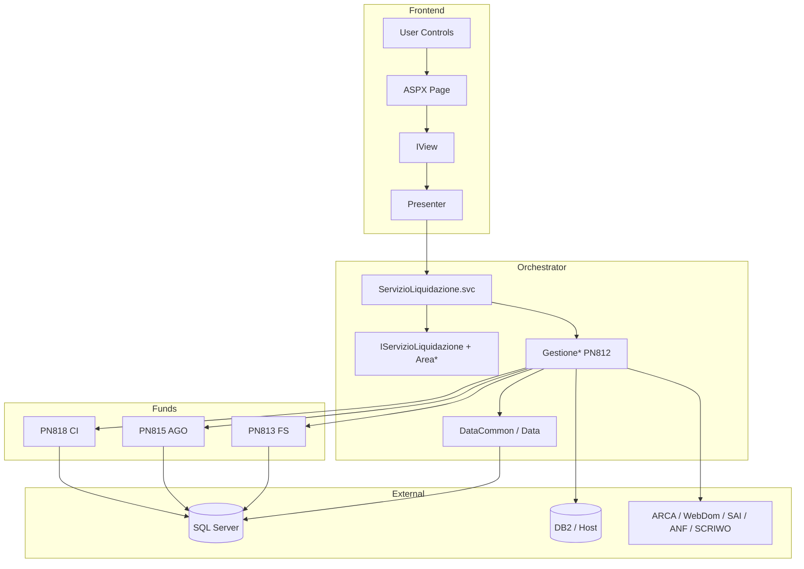
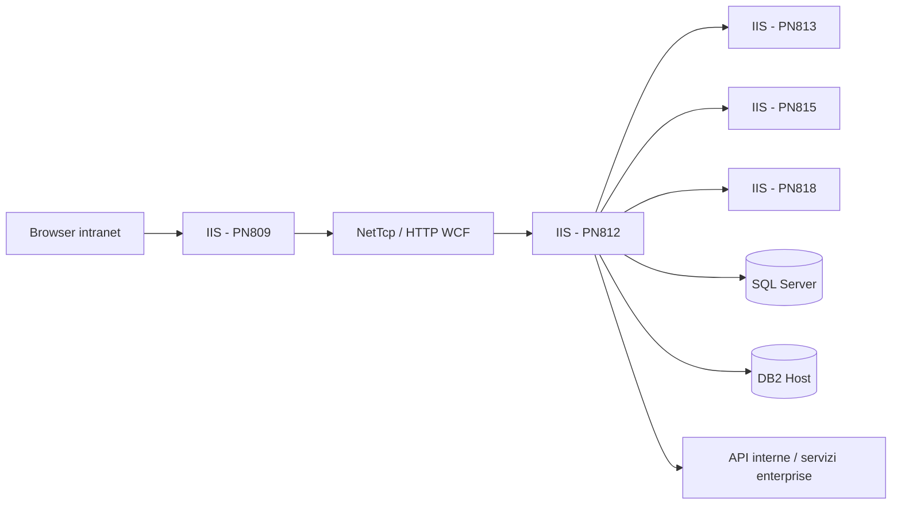

# Software Architecture - Progetto IVS_DNA

## Sezioni Principali
### 1. Architecture Style & Patterns
- **Style dominante:** layered SOA intra-enterprise.
- **Frontend pattern:** WebForms + MVP.
- **Backend pattern:** orchestratore centrale + servizi specializzati per fondo.
- **Data access pattern:** repository/DAO legacy con LINQ-to-SQL e stored procedure.
- **Integration pattern:** synchronous RPC via WCF SOAP / custom binding.

### 2. Containers & Technology Choices
| Container | Tecnologia | Responsabilità |
|---|---|---|
| PN809 | ASP.NET WebForms | UI operatore, navigazione, orchestrazione presenter |
| PN812 | WCF service | Facade/orchestratore e capability comuni |
| PN813 | WCF service | Domini fondo FS |
| PN815 | WCF service | Domini fondo AGO |
| PN818 | WCF service | Domini fondo CI |
| SQL Server | RDBMS | Persistenza pensioni, quadri, anagrafiche, decodifiche |
| DB2/Host | DB2OLEDB/CICS | Oneri e dati legacy integrati |

### 3. Component Diagram

### 4. Deployment Diagram

### 5. Integration Architecture
| Flusso | Pattern |
|---|---|
| PN809 → PN812 | Presenter → generated proxy WCF |
| PN812 → PN813/815/818 | BL orchestrator → proxy WCF generato |
| PN812 / fondi → DB | LINQ-to-SQL / SP / DataContext |
| PN812 → sistemi enterprise | SOAP/WCF, HTTP intranet, host DB2 |
| Logging | Logger DNA + log SOAP + log generici |

### 6. Architectural Risks Mitigation
| Rischio | Mitigazione esistente | Gap |
|---|---|---|
| Errore su fondo specifico | Separazione moduli PN813/815/818 | Orchestratore resta SPOF logico |
| Cambi config ambiente | Varianti `CHG*` | Processo manuale e fragile |
| Errori di business | `AreaEsito`, controlli dinamici, semafori | Poche metriche oggettive |
| Consistenza dati | `TransactionScope` | Nessuna evidenza di saga/distributed transaction |
| Eterogeneità integrazioni | Proxy e mapping dedicati | Alto costo di manutenzione |

### 7. Architectural Notes
- L’architettura non è microservizi cloud-native: è più corretto definirla **monolite distribuito per domini di fondo**.
- La qualità principale del design è la chiara separazione del perimetro funzionale per fondo.
- Il principale difetto è la centralizzazione eccessiva di contratti/orchestrazione in PN812, che amplifica l’impatto di qualsiasi change.

## Reference Documents
- `/root/IVS_DNA/README.md`
- `/root/IVS_DNA/Doc/Legacy_IVS_AnalisiTecnica.md`
- `/root/IVS_DNA/Doc/IVS_Onboarding_Tecnico.md`
- `/root/IVS_DNA/Doc/IVS_Requisiti_Tecnici_Approfonditi.md`
- `/root/IVS_DNA/Doc/Manuale_utente.md`
- `PN809/LiquidazionePensioniFS/Web.config`
- `PN812/WSInpsPensioniLiquidazione/Web.config`
- `PN812/WSInpsPensioniLiquidazione/Contracts/ServiceContracts/IServizioLiquidazione.cs`

## Change Log
- 2026-06-24 — Documento generato da analisi del repository, dei file di configurazione e della documentazione tecnica esistente.
