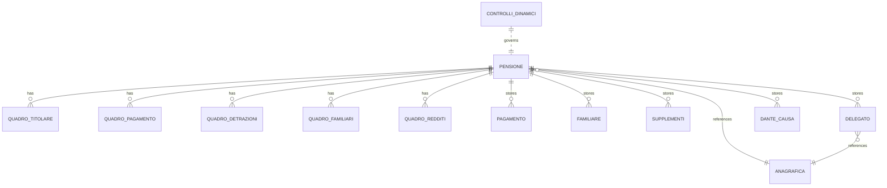

# Data - Progetto IVS_DNA

## Sezioni Principali
### 1. Logical Data Model
Le entità principali ricostruibili dal repository sono:
- **Pensione / Pensione1**: entità master della pratica pensionistica.
- **Anagrafica**: dati del soggetto titolare.
- **Quadri**: stato e dati delle sezioni applicative (`QuadroTitolare`, `QuadroPagamento`, `QuadroDetrazioni`, `QuadroFamiliari`, `QuadroRedditi`, ecc.).
- **Delegato / Tutore / Dante Causa / Familiari**.
- **Pagamento / Redditi / Supplementi / Oneri**.
- **ControlliDinamici**: regole e feature toggle runtime.
- **Decodifiche**: ampia tassonomia di tabelle lookup.

## ERD Diagram (Mermaid)

### 2. Physical Data Model
| Sorgente | Tecnologia | Evidenza |
|---|---|---|
| `Pensioni_Fs_WIP` / `Pensioni_Fs` | SQL Server | `Pensioni.dbml`, `PensioniConnectionString` |
| `Richieste2003` / WebDom | SQL Server | `WebDom.dbml`, `WebDomConnectionString` |
| `DBS_Comuni` | SQL Server | `DBS_ComuniConnectionString` |
| `A01DB2/A03DB2` | DB2 OLEDB | `DB2Conn_Oneri` |
| `CIBase` | LINQ-to-SQL DBML minimali | PN815/PN818 `CIBase.dbml` |

### 3. Data Ownership & Governance
| Dato | Ownership dedotta |
|---|---|
| Domanda pensione | WebDom / dominio centrale |
| Dati pensione lavorati | IVS_DNA / SQL Server |
| Anagrafica | ARCA come fonte autorevole, copia operativa in IVS |
| Oneri / host | Sistemi legacy esterni |
| Allegati/documenti | SCRIWO |

### 4. Data Storage & Partitioning
- La separazione logica principale è **per fondo e per capability**, non per database dedicato completo per microservizio.
- La presenza di tabelle `PensioneFondo*`, `PensioneINPDAP`, `PensioneImportiEsteriCumulo` evidenzia specializzazione dati interna al medesimo dominio.
- Non emergono dal repository meccanismi espliciti di sharding o partizionamento fisico avanzato.

### 5. Backup & Archive Strategy
- Nessuna strategia di backup o archiviazione è descritta nel repository.
- **Stato:** TBD.

### 6. Data Retention Policy
- Nel codebase non sono presenti policy formali di retention per dati applicativi, audit o log.
- **Stato:** TBD.

### 7. Log Management
- I log applicativi e SOAP vengono gestiti tramite framework `INPS.DNA` e classi `GestioneLog*`.
- Non è visibile nel repository l’infrastruttura di storage/retention dei log.
- Data masking nei log: non verificabile completamente dal solo codebase (**TBD**).

### 8. Data Risks
1. Dati personali altamente sensibili trattati su più layer e sistemi.
2. Secret in chiaro nelle connection string.
3. Forte accoppiamento tra schema e codice generato LINQ-to-SQL.
4. Regole di business anche in stored procedure, quindi visibilità parziale dal repository C#.

## Reference Documents
- `/root/IVS_DNA/README.md`
- `/root/IVS_DNA/Doc/Legacy_IVS_AnalisiTecnica.md`
- `/root/IVS_DNA/Doc/IVS_Onboarding_Tecnico.md`
- `/root/IVS_DNA/Doc/IVS_Requisiti_Tecnici_Approfonditi.md`
- `/root/IVS_DNA/Doc/Manuale_utente.md`
- `PN809/LiquidazionePensioniFS/Web.config`
- `PN812/WSInpsPensioniLiquidazione/Web.config`
- `PN812/WSInpsPensioniLiquidazione/Contracts/ServiceContracts/IServizioLiquidazione.cs`

## Change Log
- 2026-06-24 — Documento generato da analisi del repository, dei file di configurazione e della documentazione tecnica esistente.
