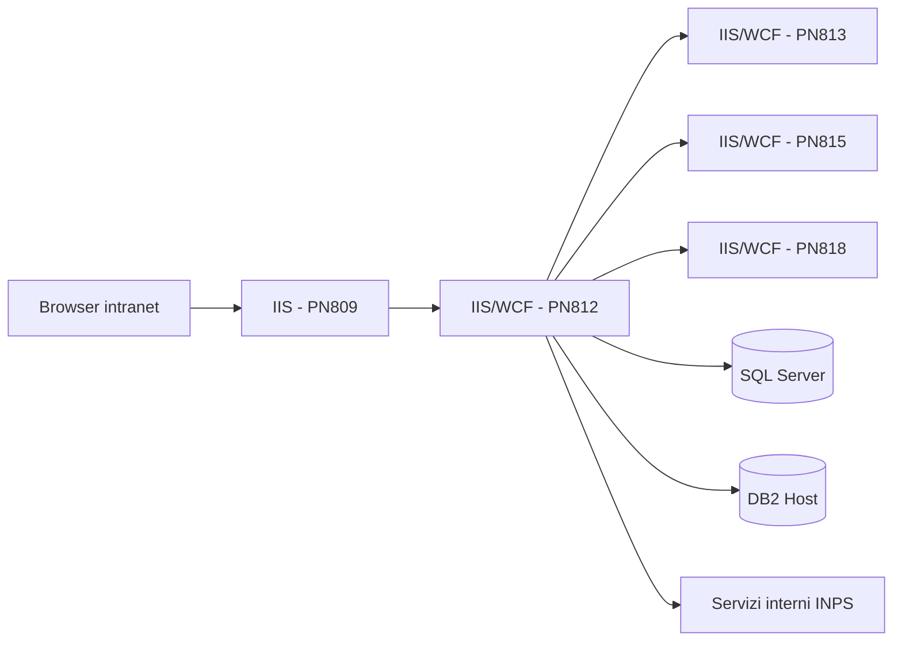

# Infrastructure Architecture - Progetto IVS_DNA

## Sezioni Principali
### 1. Infrastructure Overview
L’infrastruttura ricostruibile dal repository è una topologia intranet Windows-based composta da una web application operator-facing, da servizi WCF interni, database SQL Server e connessioni a sistemi enterprise/host.

### 2. Network Architecture
- Modello chiaramente **intranet-first**.
- Endpoint applicativi esposti su HTTP interno, `nettcp`, `netpipe` e URL intranet `api-intranet...`.
- La UI PN809 invoca servizi WCF interni, non API pubbliche internet-facing.
- Non sono presenti nel repository regole firewall, subnet o reverse proxy: **TBD**.

### 3. Hardware/VM Specifications
- Nessuna specifica hardware, sizing VM o capacità cluster è disponibile nel repository.
- **Stato:** N/A / TBD.

### 4. Redundancy & Failover
- Non emergono nel repository configurazioni di load balancing, clustering o active/passive.
- L’architettura applicativa consente separazione di moduli, ma non documenta ridondanza runtime.
- **Stato:** TBD.

### 5. Disaster Recovery
- Assenti procedure DR, RTO/RPO o evidenze di replica dati.
- **Stato:** TBD.

### 6. Environments (Dev, Test, Staging, Prod)
| Ambiente | Evidenza | Note |
|---|---|---|
| Dev | `Web.config`, URL localhost, `IdmSimulator` | Setup locale Windows/IIS |
| Test | `CHGTEST_Web.config` | Host e DB di sviluppo/test interno |
| Collaudo | `CHGCOLL_Web.config` | Ambiente pre-esercizio |
| Esercizio | `CHGESERCIZIO_Web.config` | Endpoint e DB produzione |

### 7. Infrastructure Ownership
| Area | Ownership dedotta |
|---|---|
| Web/IIS e runtime | Team infrastruttura Windows INPS |
| Database SQL Server | DBA / team dati enterprise |
| DB2 / host | Team host/mainframe |
| Sicurezza runtime DNA | Piattaforma INPS.DNA |
| Applicazione | Team manutenzione IVS |

### 8. Key Infrastructure Constraints
1. Dipendenza da ecosistema Windows/IIS.
2. Dipendenza da file di configurazione esterni DNA.
3. Dipendenza da host DB2 e servizi enterprise interni.
4. Mancanza di evidenza repository su IaC, container o automazione cloud-native.

## Reference Documents
- `/root/IVS_DNA/README.md`
- `/root/IVS_DNA/Doc/Legacy_IVS_AnalisiTecnica.md`
- `/root/IVS_DNA/Doc/IVS_Onboarding_Tecnico.md`
- `/root/IVS_DNA/Doc/IVS_Requisiti_Tecnici_Approfonditi.md`
- `/root/IVS_DNA/Doc/Manuale_utente.md`
- `PN809/LiquidazionePensioniFS/Web.config`
- `PN812/WSInpsPensioniLiquidazione/Web.config`
- `PN812/WSInpsPensioniLiquidazione/Contracts/ServiceContracts/IServizioLiquidazione.cs`

## Change Log
- 2026-06-24 — Documento generato da analisi del repository, dei file di configurazione e della documentazione tecnica esistente.
