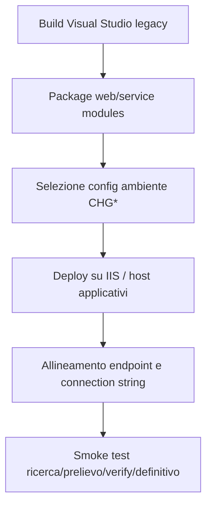

# Deployment - Progetto IVS_DNA

## Sezioni Principali
### 1. Deployment Topology
La topologia di rilascio ricostruibile è di tipo multi-tier intranet:
- Tier UI: PN809 su IIS.
- Tier service hub: PN812 su IIS/WCF.
- Tier servizi fondo: PN813, PN815, PN818 su host/service endpoint dedicati.
- Tier data: SQL Server + DB2/host + servizi enterprise interni.

### 2. Software-to-Infrastructure Mapping
| Software | Mapping runtime |
|---|---|
| PN809 | Web application IIS, frontend intranet |
| PN812 | WCF web application / service host |
| PN813 | WCF service host fondo FS |
| PN815 | WCF service host fondo AGO |
| PN818 | WCF service host fondo CI |
| Data layer | SQL Server e DB2 host |

### 3. Resource Allocation (CPU, Memory)
- Non sono disponibili nel repository sizing CPU/RAM, pool IIS, thread pool o limiti infrastrutturali.
- **Stato:** TBD.

### 4. Deployment Strategy (Blue-Green, Canary, Rolling)
- Nessuna evidenza di blue-green, canary o rolling deployment.
- Il pattern osservato è **deployment tradizionale/manuale** con selezione del file config ambiente appropriato.
- La presenza di molte varianti `CHG*` suggerisce packaging o sostituzione config in fase di rilascio.

### 5. Rollback Procedures
- Il rollback presumibile è basato su ripristino package/config precedente.
- Procedure dettagliate non presenti nel repo.
- **Stato:** TBD.

### 6. High Availability Configuration
- Non documentata.
- Esistenza di endpoint `nettcp`, `netpipe` e `mex` non implica HA.
- **Stato:** TBD.

### 7. Data Replication
- Non emergono configurazioni di replica SQL/DB2 o sincronia cross-site.
- **Stato:** TBD.

### 8. Deployment Flow osservato

### 9. Operational Deployment Risks
1. Errori manuali nella scelta del file ambiente.
2. Secret in chiaro distribuiti con il package.
3. Mancanza di pipeline automatizzata e validazioni preventive.
4. Dipendenza da infrastruttura esterna non versionata nel repo (config DNA, servizi interni).

## Reference Documents
- `/root/IVS_DNA/README.md`
- `/root/IVS_DNA/Doc/Legacy_IVS_AnalisiTecnica.md`
- `/root/IVS_DNA/Doc/IVS_Onboarding_Tecnico.md`
- `/root/IVS_DNA/Doc/IVS_Requisiti_Tecnici_Approfonditi.md`
- `/root/IVS_DNA/Doc/Manuale_utente.md`
- `PN809/LiquidazionePensioniFS/Web.config`
- `PN812/WSInpsPensioniLiquidazione/Web.config`
- `PN812/WSInpsPensioniLiquidazione/Contracts/ServiceContracts/IServizioLiquidazione.cs`

## Change Log
- 2026-06-24 — Documento generato da analisi del repository, dei file di configurazione e della documentazione tecnica esistente.
