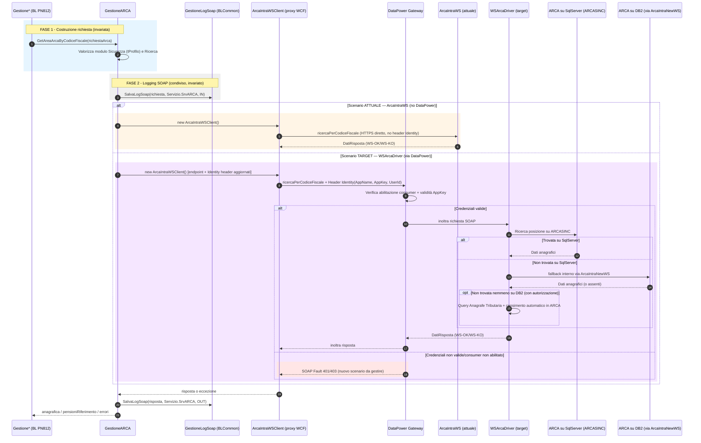

# Deep Dive Funzionale — Integrazione Esterna: Servizio ARCA (ArcaIntraWS → WSArcaDriver)

| Metadato | Valore |
|---|---|
| **Entry Point** | `External Service Integration (SOAP Client): GestioneARCA` — invocato internamente da 3 chiamate SOAP (`ricercaPerCodiceFiscale`, `ricercaPerCodiceIndividuale`, `ricercaPerDatiPersonaliParziali`) |
| **Tipo** | Integrazione sincrona verso servizio esterno (SOAP/WCF Client) |
| **Handler / Controller** | `GestioneARCA` (classe interna, namespace `INPS.Pensioni.Liquidazione`) |
| **Service** | `ArcaIntraWSClient` (WCF proxy generato dal Service Reference `SrvARCA`) |
| **Package / Module** | `PN812/WSInpsPensioniLiquidazione.BL` |
| **Tech Stack** | .NET Framework / WCF (System.ServiceModel), Service Reference SOAP 1.1 |
| **Descrizione** | Consultazione dell'Archivio Anagrafico Unico ARCA (dati anagrafici, indirizzi, familiari, pensioni di riferimento) usata dal motore di liquidazione pensioni per validare/arricchire i dati del soggetto durante il calcolo della domanda. |

---

## 1. Scopo Funzionale

Il progetto **PN812 (WSInpsPensioniLiquidazione)** consulta l'Archivio Anagrafico Unico ARCA per recuperare i dati anagrafici (residenza, familiari, sinonimi, pensioni collegate) necessari al calcolo e alla liquidazione delle pensioni. Questa consultazione avviene oggi tramite il servizio legacy **ArcaIntraWS**, esposto direttamente da INPS **senza passare da DataPower** (endpoint `serviziexz.*.inps.it/ArcaIntraWS/services/ArcaIntraWS`).

È stato chiesto di valutare l'impatto della migrazione verso il nuovo servizio **WSArcaDriver**, che espone **lo stesso WSDL/contratto** di ArcaIntraWS ma è **esposto attraverso l'infrastruttura DataPower** (architettura SOA dell'Istituto). WSArcaDriver introduce inoltre una logica di **fallback lato server**: consulta prima i dati su SqlServer (DB `ARCASINC`) e solo se la posizione non è trovata richiama internamente `ArcaIntraNewWS` su DB2; se la posizione non è presente nemmeno su DB2, con apposita autorizzazione, il servizio può interrogare l'Anagrafe Tributaria per censire automaticamente la posizione in ARCA.

Poiché ogni chiamata a un servizio DataPower richiede **abilitazione esplicita del consumer** (applicazione client) per ciascun ambiente (sviluppo/collaudo/produzione) e l'invio di **credenziali applicative** (`AppName`/`AppKey`) in un header SOAP dedicato, la migrazione non è puramente un cambio di URL: comporta attività di onboarding (SOA/DataPower), gestione sicura delle credenziali in configurazione e — con ogni probabilità — una modifica di codice per iniettare l'header `Identity` richiesto dal gateway.

---

## 2. Impatto sui Progetti IVS (PN809 / PN812 / PN813 / PN815 / PN818)

Analisi del codice sorgente sul branch `main` del repository `davalentin/IVS_DNA` per verificare dove l'integrazione ArcaIntraWS è effettivamente utilizzata.

| Progetto | Nome tecnico | Riferimento diretto ad ArcaIntraWS? | Impatto | Note |
|---|---|---|---|---|
| **PN812** | `WSInpsPensioniLiquidazione` | ✅ Sì — Service Reference `SrvARCA` (`ArcaIntraWSClient`), classe `GestioneARCA.cs`, endpoint in `Web.config`/`CHG*_Web.config`/`app.config` | 🔴 **Impatto diretto e completo** | Unico progetto che possiede il client SOAP verso ARCA. Codice, configurazione e test devono essere aggiornati. |
| **PN813** | `WSInpsPensioniLiquidazioneFS` | ❌ Nessun riferimento (`grep` su sorgenti: 0 match) | 🟢 Nessun impatto funzionale diretto | Referenzia solo `INPS.Pensioni.Liquidazione.BLCommon.dll` e `DataCommon.dll` (via `dll_esterne`), librerie che **non contengono** `GestioneARCA` (verificato: la classe è compilata solo nel progetto `.BL` di PN812, non in `BLCommon`). |
| **PN815** | `WSInpsPensioniLiquidazioneAgo` | ❌ Nessun riferimento | 🟢 Nessun impatto funzionale diretto | Stessa dipendenza (`BLCommon.dll`/`DataCommon.dll`) di PN813, stesso esito. |
| **PN818** | `WSInpsPensioniLiquidazioneCi` | ❌ Nessun riferimento | 🟢 Nessun impatto funzionale diretto | Stessa dipendenza (`BLCommon.dll`/`DataCommon.dll`) di PN813, stesso esito. |
| **PN809** | `LiquidazionePensioniFS` (front-end) | ❌ Nessun riferimento | 🟢 Nessun impatto | Consuma solo il servizio esposto da **PN813** (`Service References/SvrLiquidazioneFs`), non PN812. Nessuna relazione, nemmeno indiretta, con l'integrazione ARCA. |

### 2.1 Come è stata verificata l'assenza di impatto su PN809/813/815/818

1. Ricerca testuale (`ArcaIntraWS`, `ArcaIntraNewWS`, `GestioneARCA`, `SrvARCA`) su tutti i sorgenti `.cs`/`.config` dei 4 progetti → **0 occorrenze**.
2. Verifica dei `.csproj` di PN813/815/818: le uniche reference verso l'ecosistema PN812 sono `INPS.Pensioni.Liquidazione.BLCommon.dll` e `INPS.Pensioni.Liquidazione.DataCommon.dll` (copiate in `dll_esterne/`).
3. Verifica che `GestioneARCA.cs` sia incluso **solo** nei `.csproj` del progetto `WSInpsPensioniLiquidazione.BL` (PN812) e non in `WSInpsPensioniLiquidazione.BLCommon` (la libreria condivisa).
4. Verifica dei chiamanti di `GestioneARCA.*`: tutti i 7 file chiamanti (`GestioneAreaAventiDiritto`, `GestioneCalcoloDomanda`, `GestioneAreaAltreDomandeCollegate`, `GestioneAreaRiepilogo`, `GestioneDatiPensioni`, `GestioneSoggetti`, `GestioneAreaPrelievo`) risiedono in `PN812/WSInpsPensioniLiquidazione.BL`.
5. Verifica dei Service Reference di PN809/813/815/818: nessuno punta al servizio esposto da PN812; PN809 → PN813 (`SvrLiquidazioneFs`), PN813/815/818 → servizi terzi (`HisLiquidazioneFs`, `msCCQualityDataChecker`, `swaggerMiddleware`, ecc.), non correlati ad ARCA.

> ⚠️ **Nota**: se in futuro PN813/815/818 dovessero avere necessità di consultare ARCA (oggi non presente), dovrebbero replicare l'integrazione (idealmente spostando `GestioneARCA` in `BLCommon` per riuso), e in quel momento erediterebbero automaticamente la configurazione DataPower/WSArcaDriver qui descritta.

---

## 3. Input / Output

### 3.1 Input — Header SOAP di sicurezza DataPower (nuovo, richiesto da WSArcaDriver)

```xml
<!-- Header SOAP aggiuntivo richiesto dall'infrastruttura DataPower -->
<soapenv:Header>
  <Identity xmlns="http://inps.it/">
    <AppName>NOME_APPLICAZIONE_CLIENT</AppName>   <!-- assegnato in fase di abilitazione -->
    <AppKey>CHIAVE_APPLICATIVA</AppKey>            <!-- credenziale da configurare, NON in chiaro nei sorgenti -->
    <UserId>UTENTE_INPS</UserId>
    <IdentityProvider>AD</IdentityProvider>
  </Identity>
</soapenv:Header>
```

Questo header **non è richiesto oggi** dall'endpoint legacy `ArcaIntraWS` (che non transita da DataPower) ed è la principale differenza "di credenziali" tra i due servizi.

### 3.2 Input — Corpo del messaggio (invariato: stesso WSDL)

| Modulo | Nome Copy COBOL | Descrizione | Obbligatorio |
|---|---|---|---|
| **S001 — Sicurezza** | `ARWS001` | Profilo operatore/applicazione (`CodiceTipoOperatore`, `Provenienza`, `CodiceFiscaleOperatore`, `MatricolaINPS`, `SedeRichiesta`, `GestioneApplOrigine`, `SedeApplOrigine`, `PgmApplOrigine`, `TranApplOrigine`) | Sì |
| **F102 — Ricerca** | `ARWF102` | Criteri di ricerca (codice fiscale, codice ARCA, codice individuale, dati anagrafici, archivi gestionali) | Sì |
| **Z001 — Chiusura** | `ARWZ001` | Segnala il termine dei dati inviati | Sì |

### 3.3 Campi critici del modulo Sicurezza

| Campo | Tipo | Obbligatorio | Descrizione |
|---|---|---|---|
| `CodiceTipoOperatore` | string(1) | Sì | `U` = operatore INPS, `E` = operatore esterno |
| `Provenienza` | string(2) | Sì | `PC` = applicazione, `IN` = operatore INPS |
| `CodiceFiscaleOperatore` | string(16) | No | Codice fiscale dell'operatore |
| `MatricolaINPS` | string | Sì | Matricola operatore |
| `SedeRichiesta` | string(6) | Sì | Sede da cui proviene la richiesta |
| `GestioneApplOrigine` | string | Sì | Codice archivio applicativo di origine |
| `PgmApplOrigine` | string | Sì | Nome programma applicativo (deve essere censito in `TARCAPPL`) |

### 3.4 Output (invariato: stesso schema di risposta)

```xml
<!-- Risposta con dettaglio anagrafico -->
<DatiRisposta>
  <Esito>
    <ReturnCode>WS-OK</ReturnCode>          <!-- WS-OK oppure WS-KO -->
    <Descrizione>...</Descrizione>
  </Esito>
  <Dettaglio>
    <AllProfile>
      <DatiPersonali>...</DatiPersonali>
      <DatiIndirizzo>...</DatiIndirizzo>
      <DatiIndirizzoEstero>...</DatiIndirizzoEstero>
    </AllProfile>
  </Dettaglio>
</DatiRisposta>
```

In caso di errore di sicurezza sull'header `Identity` (nuovo con DataPower), il servizio risponde con `ReturnCode = WS-KO` e descrizione tipo `"Errore durante la chiamata ad ArcaIntraWS"` (comportamento documentato in `AA041_ArcaDriver - Request e Response di esempio_v1.pdf`).

---

## 4. Flusso di Esecuzione Dettagliato

### 4.1 FASE 1 — Costruzione della richiesta (invariata)

`GestioneARCA` (in `PN812/WSInpsPensioniLiquidazione.BL/GestioneARCA.cs`) espone 3 punti di chiamata SOAP:

- `GetAreaArcaByCodiceFiscale` → `proxy.ricercaPerCodiceFiscale(richiesta)` (riga 63)
- `GetAreaArcaByCodiceSoggetto` → `proxy.ricercaPerCodiceIndividuale(richiesta)` (riga 181)
- `GetAreaArcaByDatiPersonaliParziali` → `proxy.ricercaPerDatiPersonaliParziali(richiesta)` (riga 307)

Ogni metodo valorizza i moduli `Sicurezza` (`tProfilo`) e `Ricerca` a partire dai dati di `RichiestaARCA` passati dal chiamante, quindi istanzia `ArcaIntraWSClient` (proxy WCF generato dal Service Reference `SrvARCA`).

### 4.2 FASE 2 — Logging SOAP (invariata, infrastruttura condivisa in BLCommon)

Prima della chiamata, `GestioneLogSoap.SalvaLogSoap(richiesta, Utility.Servizio.SrvARCA, ..., SOAPLogDirection.IN, ...)` registra la richiesta su tabella di log (via `DAGestioneLogSoap.Insert_LogSoap`, progetto `WSInpsPensioniLiquidazione.DataCommon`). Questa infrastruttura è generica e condivisa, ma **viene invocata solo da PN812** (nessun altro progetto usa `Servizio.SrvARCA`).

### 4.3 FASE 3 — Invocazione del servizio (da modificare)

**Oggi**: `proxy.ricercaPerXxx(richiesta)` invoca l'endpoint `https://serviziexz.<ambiente>.inps.it/ArcaIntraWS/services/ArcaIntraWS`, binding `customBinding "WsSOAP1"` (SOAP 1.1 su HTTPS, `security mode="None"`, nessun header di identità applicativa).

**Domani (WSArcaDriver)**: la stessa chiamata dovrà:
1. Puntare all'endpoint DataPower (`https://ws.<ambiente>.inps/Ws.Net/wsArcaDriver`).
2. Iniettare l'header SOAP `Identity` (AppName/AppKey/UserId/IdentityProvider) — richiede un `IClientMessageInspector`/`IEndpointBehavior` custom oppure l'estensione del binding, poiché il contratto WSDL attuale non prevede questo header nella definizione dei parametri del metodo.
3. Gestire il nuovo possibile esito applicativo legato al fallback interno (SqlServer → DB2 → eventuale Anagrafe Tributaria), che è trasparente lato client ma può introdurre **latenza variabile** a seconda di dove viene trovata la posizione.

### 4.4 FASE 4 — Gestione risposta ed errori (invariata)

Gestione esistente di `FaultException<DnaApplicationFaultContract>`, `DnaSecurityFaultContract`, `EndpointNotFoundException`, `CommunicationException` in `GestioneARCA.cs` rimane valida. Va aggiunta gestione esplicita per i nuovi possibili errori DataPower (es. `401/403` per credenziali applicative non abilitate/scadute, tipicamente restituiti come `SOAP Fault` dal gateway prima ancora di raggiungere WSArcaDriver).

---

## 5. Tabelle / Collezioni DB Coinvolte

| Tabella / Collezione | Tipo | Fase | Descrizione |
|---|---|---|---|
| Log SOAP (`Insert_LogSoap`, progetto `DataCommon`) | Write | Prima/dopo la chiamata | Traccia richiesta/risposta XML per diagnostica (generica per tutti i servizi SOAP, incluso ARCA) |
| `ARCASINC` (SqlServer, lato server WSArcaDriver) | Read (lato server, non visibile al client) | Interna al servizio | Nuovo storage primario consultato da WSArcaDriver prima del fallback su DB2 |
| Archivi DB2 host ARCA (via `ArcaIntraNewWS`, lato server) | Read (lato server) | Fallback interno | Consultati automaticamente da WSArcaDriver se il dato non è su SqlServer |

---

## 6. Integrazioni Esterne

| Servizio | Metodo / Endpoint | Protocollo | Ambiente | Scopo |
|---|---|---|---|---|
| **ArcaIntraWS (attuale)** | `https://serviziexz.sviluppo.inps.it/ArcaIntraWS/services/ArcaIntraWS` | SOAP 1.1 / HTTPS (no DataPower) | Sviluppo | Consultazione anagrafica ARCA |
| **ArcaIntraWS (attuale)** | `https://serviziexz.collaudo.inps.it/ArcaIntraWS/services/ArcaIntraWS` | SOAP 1.1 / HTTPS (no DataPower) | Collaudo |  |
| **ArcaIntraWS (attuale)** | `https://serviziexz.inps.it/ArcaIntraWS/services/ArcaIntraWS` | SOAP 1.1 / HTTPS (no DataPower) | Produzione |  |
| **WSArcaDriver (target)** | `https://ws.svil.inps/Ws.Net/wsArcaDriver` | SOAP 1.1 / HTTPS **via DataPower** | Sviluppo | Stesso WSDL/metodi; fallback interno su DB2/Anagrafe Tributaria |
| **WSArcaDriver (target)** | `https://ws.ser-collaudo.inps/Ws.Net/wsArcaDriver` | SOAP 1.1 / HTTPS via DataPower | Collaudo |  |
| **WSArcaDriver (target)** | `https://ws.inps/Ws.Net/wsArcaDriver` | SOAP 1.1 / HTTPS via DataPower | Produzione |  |
| **WSArcaDriver (target, no-DP)** | `http://msws.svil.inps/wsArcaDriver/wsArcaDriver.svc` | SOAP 1.1 / HTTP (test diretto senza DataPower) | Solo sviluppo/debug | Utile per collaudo isolato prima dell'onboarding DataPower |
| **ArcaAbilitazioniWEB** | `http://aixws7test2.inps.it/ArcaAbilitazioniWEB/` | HTTP / Web App | Solo sviluppo | Censimento del nuovo consumer applicativo per l'ambiente di sviluppo |

**Configurazione .NET impattata** (stesso pattern in tutti i file, da aggiornare **solo in PN812**):

- `PN812/WSInpsPensioniLiquidazione/Web.config` (riga ~523: endpoint `IWsArca` sviluppo)
- `PN812/WSInpsPensioniLiquidazione/CHGESERCIZIO_Web.config` (produzione)
- `PN812/WSInpsPensioniLiquidazione/CHGCOLL_Web.config` (collaudo)
- `PN812/WSInpsPensioniLiquidazione/CHGTEST_Web.config` (test)
- `PN812/WSInpsPensioniLiquidazione.BL/app.config`
- `PN812/WSInpsPensioniLiquidazione.UnitTest/App.config`
- `PN812/WSInpsPensioniLiquidazione.BL/Service Reference/ARCAClient.cs` e `Service References/SrvARCA/*.wsdl` (da rigenerare/validare contro l'endpoint WSArcaDriver, pur essendo lo stesso contratto)

> Nota positiva: altri endpoint dello stesso `Web.config` (es. `ArcaManWS` su `https://ws.svil.inps/host/ArcaManWS`, `WSDelegheSindacali`, `WSGestionePeco`, `DatiPensioniSOAP`) **già transitano da DataPower** riusando lo stesso `bindingConfiguration="WsSOAP1"` e `behaviorConfiguration="Client"`. È quindi già presente e collaudato un binding compatibile con DataPower nello stesso progetto: la migrazione può riusare questo pattern di configurazione invece di crearne uno nuovo da zero.

---

## 7. Gestione Errori e Rollback

### 7.1 Errori di validazione
Invariati: mancata valorizzazione dei moduli `Sicurezza`/`Ricerca` produce `WS-KO` con messaggio applicativo (vedi `AA041_ArcaDriver - Request e Response di esempio_v1.pdf`).

### 7.2 Errori in fase di esecuzione (nuovi, da gestire)
- **Credenziali applicative non abilitate/scadute** (`AppKey` non valida o consumer non abilitato su DataPower per l'ambiente target) → tipicamente Fault HTTP 401/403 restituito dal gateway, non gestito oggi da `GestioneARCA.cs` (che intercetta solo `FaultException`/`CommunicationException`/`EndpointNotFoundException` generici SOAP).
- **Timeout aggiuntivo** dovuto al fallback interno SqlServer→DB2→Anagrafe Tributaria lato server: da validare con test di performance, poiché il timeout WCF configurato per l'endpoint legacy potrebbe non essere sufficiente per lo scenario peggiore (fallback completo).

### 7.3 Rollback
Nessun rollback transazionale applicativo coinvolto (chiamata di sola consultazione, idempotente). Il rischio riguarda esclusivamente la disponibilità/latenza del servizio esterno.

### 7.4 Transazionalità
Il logging SOAP (`SalvaLogSoap`) usa `TransactionScopeOption.Suppress`, quindi non è impattato da eventuali fallimenti della chiamata ARCA.

---

## 8. Diagramma di Sequenza



---

## 9. Considerazioni Architetturali

### 9.1 Performance
- Il fallback interno di WSArcaDriver (SqlServer → DB2 → Anagrafe Tributaria) è trasparente ma può aumentare la latenza rispetto alla chiamata diretta odierna, specialmente per posizioni non ancora migrate su `ARCASINC`. Consigliato un test di carico comparativo prima del passaggio in produzione.
- Il passaggio attraverso DataPower aggiunge un hop di rete e un ulteriore livello di controllo (autenticazione/autorizzazione), con impatto minimo ma non nullo sulla latenza.

### 9.2 Consistenza Transazionale
Nessun impatto: operazione di sola lettura, nessuna transazione distribuita coinvolta.

### 9.3 Rischi Identificati
- **Credenziali hardcoded o in chiaro**: `AppKey` non deve essere salvata in chiaro nei file `.config` versionati; valutare l'uso di un secret store / variabile d'ambiente / sezione protetta (`configProtectionProvider`) coerente con le altre credenziali applicative già gestite dal progetto.
- **Onboarding DataPower propedeutico e bloccante**: la richiesta di abilitazione al gruppo SOA deve essere fatta per ciascun ambiente (sviluppo, collaudo, produzione) **prima** del rilascio; l'abilitazione via `ArcaAbilitazioniWEB` copre **solo l'ambiente di sviluppo** — collaudo e produzione richiedono approvazione via referenti INPS (processo email, non self-service).
- **Comportamento applicativo diverso in caso di posizione non trovata su ARCA**: con l'autorizzazione specifica, WSArcaDriver può inserire automaticamente la posizione in ARCA tramite Anagrafe Tributaria — un side-effect non presente oggi con ArcaIntraWS. Da validare esplicitamente con il team funzionale se questo comportamento è desiderato o da disabilitare.
- **Gestione errori non allineata**: `GestioneARCA.cs` non gestisce oggi eccezioni/fault specifiche del gateway DataPower (401/403 per consumer non abilitato); necessaria una on gestione esplicita per messaggi di errore comprensibili agli utenti/operatori.
- **Rigenerazione Service Reference**: sebbene il WSDL sia dichiarato identico, è comunque raccomandato rigenerare/validare il proxy (`Service References/SrvARCA`) contro l'endpoint WSArcaDriver per intercettare eventuali differenze non documentate (namespace, versioning).
- **Nessun impatto su PN809/PN813/PN815/PN818**: confermato da analisi statica del codice; non sono richieste modifiche in questi progetti per questa migrazione.

---

## 10. Piano di Migrazione Consigliato

1. **Onboarding DataPower**: richiedere abilitazione consumer per PN812 su ambiente sviluppo tramite `ArcaAbilitazioniWEB`; richiedere in parallelo abilitazione collaudo/produzione ai referenti INPS (processo email).
2. **Gestione credenziali**: definire dove/come conservare `AppName`/`AppKey` (secret store aziendale o sezione protetta di configurazione), per ambiente.
3. **Codice**: aggiungere un `IEndpointBehavior`/`IClientMessageInspector` (o estendere il binding) per iniettare l'header SOAP `Identity` sulle chiamate del proxy `ArcaIntraWSClient` usato in `GestioneARCA.cs`.
4. **Configurazione**: aggiornare gli endpoint in `Web.config`/`CHG*_Web.config`/`app.config`/`UnitTest App.config` puntando agli URL WSArcaDriver per ciascun ambiente, riusando il binding `WsSOAP1` già collaudato per altri servizi DataPower nello stesso progetto.
5. **Test**: validare in sviluppo contro l'endpoint diretto senza DataPower (`http://msws.svil.inps/wsArcaDriver/wsArcaDriver.svc`) e poi contro l'endpoint DataPower reale; eseguire test di regressione su `ArcaTest.cs` (progetto `WSInpsPensioniLiquidazione.UnitTest`).
6. **Gestione errori**: estendere il catch di `GestioneARCA.cs` per intercettare e loggare in modo distinto i fault DataPower (credenziali/abilitazione).
7. **Rilascio graduale**: sviluppo → collaudo → produzione, con verifica esplicita del comportamento di fallback (SqlServer/DB2/Anagrafe Tributaria) su un set di posizioni di test note.

---

## 11. Glossario

| Termine | Significato |
|---|---|
| **ARCA** | Archivio Anagrafico Unico INPS |
| **ArcaIntraWS / ArcaIntraNewWS** | Servizio SOAP legacy di consultazione ARCA su DB2, esposto senza infrastruttura DataPower |
| **WSArcaDriver** | Nuovo servizio SOAP (stesso WSDL di ArcaIntraWS) che consulta prima SqlServer (`ARCASINC`) e in fallback DB2/Anagrafe Tributaria, esposto tramite DataPower |
| **DataPower** | Infrastruttura di sicurezza SOA dell'Istituto attraverso cui devono transitare le chiamate ai nuovi servizi web; richiede abilitazione del consumer e credenziali applicative |
| **AppName / AppKey** | Credenziali applicative (identità del consumer) da inviare nell'header SOAP `Identity` per l'autenticazione presso DataPower |
| **ArcaAbilitazioniWEB** | Applicazione web per il censimento dei nuovi consumer dei servizi ARCA (solo ambiente di sviluppo; collaudo/produzione via referenti INPS) |
| **BLCommon** | Libreria condivisa (`INPS.Pensioni.Liquidazione.BLCommon.dll`) compilata da PN812 e distribuita come DLL esterna a PN813/PN815/PN818 — non contiene l'integrazione ARCA |

---

*Documento generato tramite deep dive funzionale / analisi di impatto sui progetti `PN809`, `PN812`, `PN813`, `PN815`, `PN818` del repository `davalentin/IVS_DNA` (branch `main`).*
